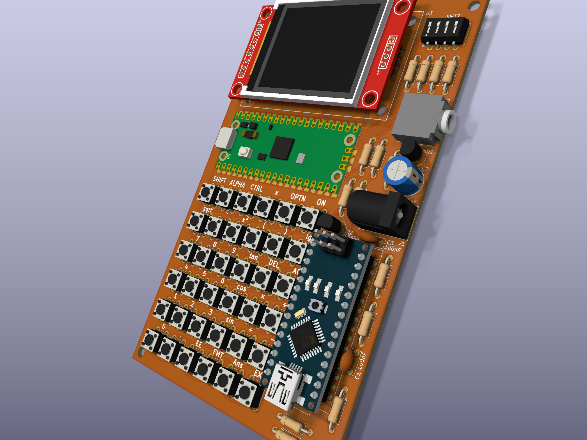

[English](README.md)

# Calculator | Operator Lambda


一款面向树莓派 Pico 的科学/图形计算器固件，内置 CAS（计算机代数系统）与图形显示支持。

PCB 预览：



**状态**：积极开发中。核心 CAS 与显示子系统已部分实现，基本算术、表达式解析与化简功能可用。积分与矩阵运算正在推进中。

---

## 功能特性

- CAS 核心：表达式解析、化简、微分、积分（部分）、有理数运算、符号操作。
- 显示：1.8 英寸 ST7735 TFT（160×128），支持定制字体渲染（已包含 ClassWiz 风格字体）。
- 输入：6×6 矩阵键盘，去抖处理，映射至数学运算符。
- 存储：SD 卡支持（进行中），用于加载程序与数据。
- 模块化设计：CAS、显示接口、输入处理与硬件抽象层分离。

---

## 硬件需求

- 主控：树莓派 Pico（或其他 RP2040 开发板）与 Arduino Nano
- 屏幕：ST7735 驱动的 1.8 英寸 TFT（SPI 接口，可选 SD 卡槽）
- 键盘：6×6 矩阵键盘（定制 PCB，见 `hardware/kicad` 目录）
- 可选：SD 卡模块（SPI）

接线参考 `wiring.txt`（已废弃）与 `hardware/kicad/` 中的原理图及 PCB 设计。Gerber 文件位于 `hardware/gerber*.zip`。

---

## 项目结构

```
calculator/
├── CMakeLists.txt          # 构建配置
├── build.sh                # 便捷构建脚本
├── inc/                    # 头文件
│   ├── cas/                # CAS 核心（解析、化简、积分等）
│   └── dispinterface/      # 显示抽象层
├── src/                    # 源文件
│   ├── main.cpp            # 程序入口
│   └── cas/                # CAS 实现
├── fonts/                  # 生成的字体数据（ClassWiz 风格）
├── font2h/                 # 字体转换工具（font2h、preview）
├── hardware/               # PCB 设计（KiCad、Fritzing(弃用)、Gerber）
├── test/                   # 单元测试（CAS 函数）
├── resources/              # 图片资源（Logo、PCB 预览）
└── LICENSE                 # GPLv3 许可证
```

---

## 构建说明

1. 安装 [树莓派 Pico SDK](https://github.com/raspberrypi/pico-sdk) 与工具链（arm-none-eabi-g++、CMake）。
2. 克隆本仓库：
   ```
   git clone https://github.com/hdkghc/calculator.git
   cd calculator
   ```
3. 构建：
   - 推荐：执行 `./build.sh`（自动完成 CMake 配置与构建）。
   - 手动：
     ```
     mkdir build && cd build
     cmake ..
     make
     ```
4. 烧录：将生成的 `.uf2` 文件拖拽至 Pico 的 Mass Storage 设备，或使用 `picotool` 工具。

---

## 依赖

- 树莓派 Pico SDK（必需）
- C++17 编译器（`arm-none-eabi-g++`）

---

## 许可证

本项目采用 **GNU 通用公共许可证第三版（GPLv3）**。  
详见 [LICENSE](LICENSE) 文件。

---

## 免责声明

本项目为业余非商业开源项目。所有硬件与软件均按“现状”提供，不附带任何明示或暗示的担保。作者不对因使用、组装或修改本项目所导致的任何人身伤害或财产损失承担责任。

---

## 贡献

欢迎贡献代码！请阅读 [CONTRIBUTING.md](CONTRIBUTING.md) 了解贡献指南。