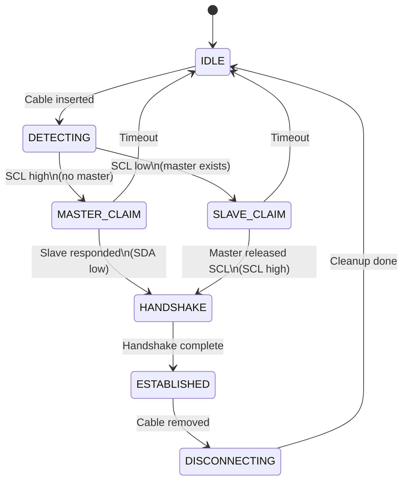
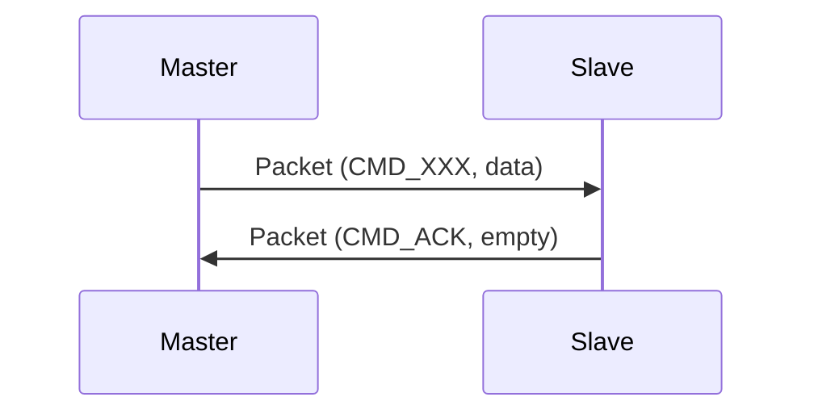
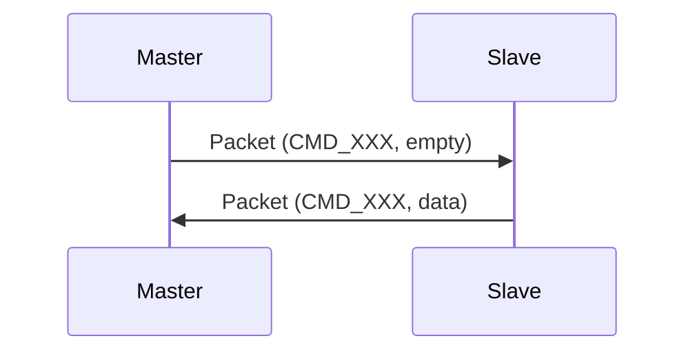
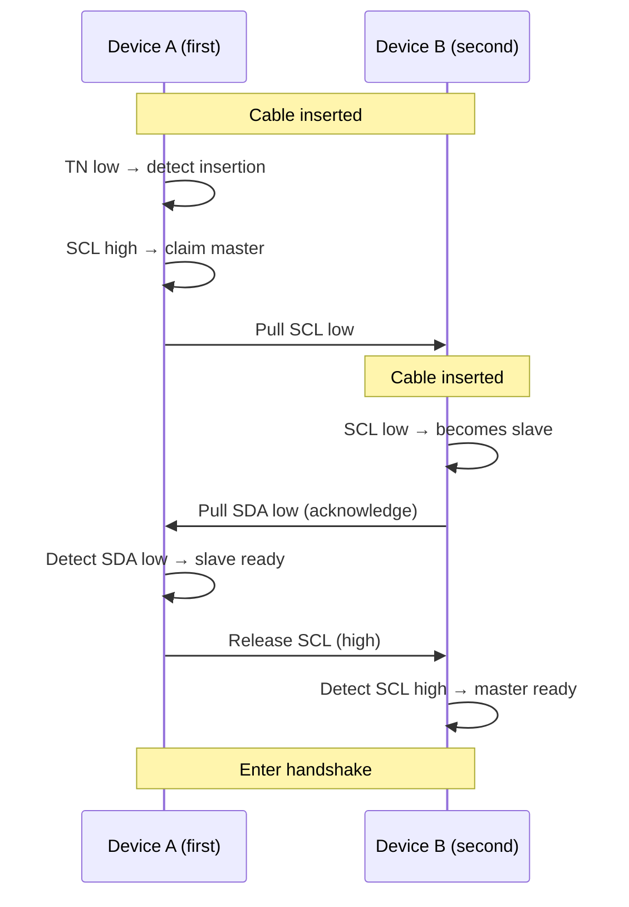
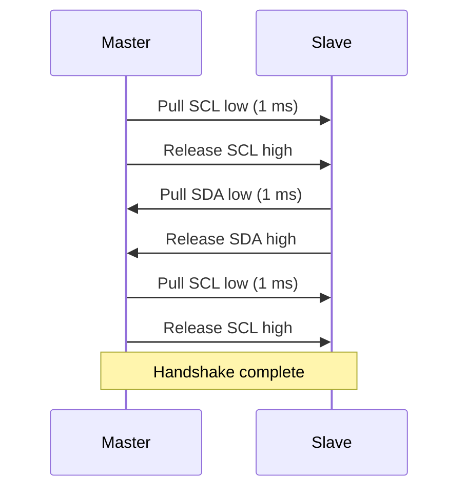
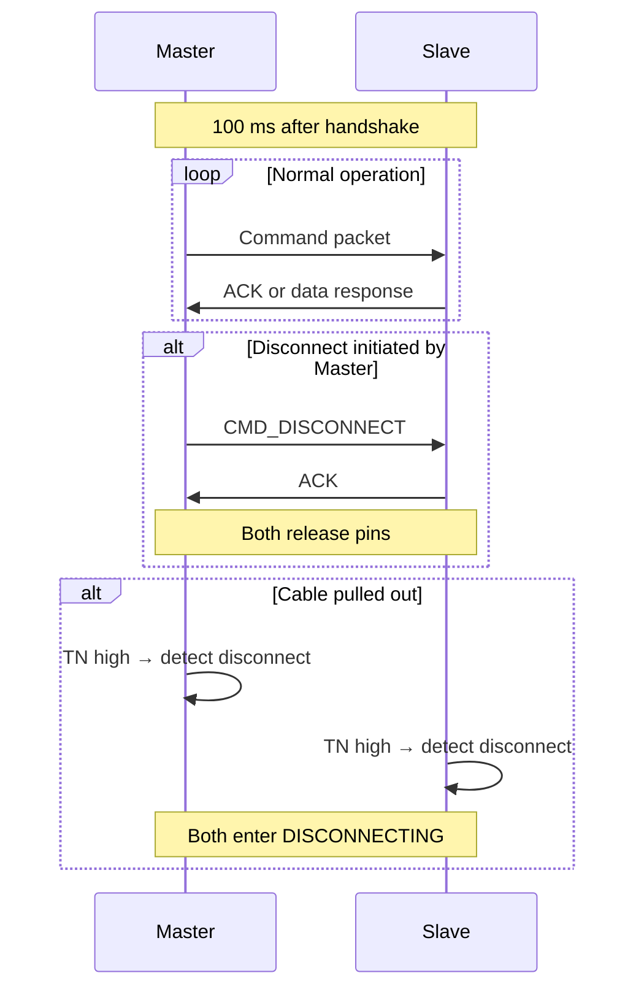

# I2C Communication Protocol Documentation

**Version:** 1.0  
**Date:** 2026-07-22  
**Author:** hdkghc  
**Project:** Calculator  

---

## 1. Overview

This document describes the communication protocol and implementation for data exchange between two Raspberry Pi Pico devices over a 3.5mm audio jack. The system supports dynamic master/slave negotiation, reliable packet-based data transfer, and asynchronous file transmission.

### 1.1 Key Features

| Feature | Description |
| :--- | :--- |
| Dynamic Master/Slave Negotiation | The device that plugs in first automatically becomes the master. |
| Physical Connection Detection | Real‑time cable detection via GPIO7 (TN pin). |
| Reliable Packet Protocol | CRC16 checksum ensures data integrity. |
| I2C Data Exchange | Standard 100 kHz rate. |
| Asynchronous File Transfer | Dual‑core parallel processing with progress tracking. |
| Dual‑core Architecture | Core 0: main loop/UI; Core 1: file transfer. |
| Hot‑plug Support | Automatic disconnection detection and recovery. |

### 1.2 Pin Definitions

| Pin | Definition |
| :--- | :--- |
| **TN** | Tip Normal – normally‑closed switch contact for the tip. |
| **RN** | Ring Normal – normally‑closed switch contact for the ring. |
| **T** | Tip – audio plug tip, used as I2C SDA. |
| **R** | Ring – audio plug ring, used as I2C SCL. |
| **S** | Sleeve – audio plug sleeve, used as GND. |

---

## 2. Hardware Interface

### 2.1 Pin Assignment

Both Picos use identical pin assignments for symmetric operation.

| Audio Jack Pin | Pico GPIO | Function | Pull Configuration |
| :--- | :--- | :--- | :--- |
| T (Tip) | GPIO4 | I2C SDA | 4.7 kΩ pull‑up to 3.3 V |
| R (Ring) | GPIO5 | I2C SCL | 4.7 kΩ pull‑up to 3.3 V |
| S (Sleeve) | GND | Common ground | Direct connection |
| RN (Ring Normal) | GPIO6 | Cable detection (SCL side) | 100 kΩ pull‑down to GND |
| TN (Tip Normal) | GPIO7 | Cable detection (SDA side) | 100 kΩ pull‑down to GND |

### 2.2 Connection Detection Logic

| State | TN/RN Level | Meaning |
| :--- | :--- | :--- |
| No cable inserted | High (3.3 V, from pull‑up) | No connection |
| Cable inserted | Low (0 V, from pull‑down) | Connection established |
| Cable removed | High (3.3 V, restored by pull‑up) | Connection lost |

> **Note:** Detection uses stable DC levels, not transient pulses, so no software debouncing is required.

### 2.3 Electrical Characteristics

| Parameter | Value | Condition |
| :--- | :--- | :--- |
| I2C bus voltage | 3.3 V | VDDIO |
| I2C communication speed | 100 kHz | Standard mode |
| Pull‑up resistors | 4.7 kΩ ± 5% | SDA and SCL lines |
| Pull‑down resistors | 100 kΩ ± 5% | RN and TN lines |
| Recommended cable length | ≤ 1 m | Longer may cause signal distortion |
| Logic low (VIL) | ≤ 0.8 V | 3.3 V logic |
| Logic high (VIH) | ≥ 2.0 V | 3.3 V logic |

---

## 3. Communication Protocol

### 3.1 Packet Structure

All packets follow a unified format for reliable transmission.

| Field | Offset | Size | Endianness | Description |
| :--- | :--- | :--- | :--- | :--- |
| `Length` | 0 | 2 | Big‑endian | Number of data bytes (0–480) |
| `Command` | 2 | 1 | N/A | Operation code (see section 3.2) |
| `Data` | 3 | N | N/A | Application payload (0–480 bytes) |
| `Checksum` | 3+N | 4 | Big‑endian | CRC16 of the data (extended to 32 bits, only lower 16 bits used) |

### 3.2 Command Codes

| Command | Value | Direction | Description |
| :--- | :--- | :--- | :--- |
| `CMD_HANDSHAKE` | 0x01 | Bidirectional | Handshake initiation |
| `CMD_ACK` | 0x02 | Bidirectional | Positive acknowledgment |
| `CMD_NACK` | 0x03 | Bidirectional | Negative acknowledgment |
| `CMD_PING` | 0x04 | Master → Slave | Keep‑alive / heartbeat |
| `CMD_STATUS` | 0x05 | Master → Slave | Query device status |
| `CMD_RESET` | 0x06 | Master → Slave | Reset remote device |
| `CMD_FILE_DATA` | 0x10 | Master → Slave | File data chunk |
| `CMD_FILE_END` | 0x11 | Master → Slave | End of file transmission |
| `CMD_FILE_REQ` | 0x12 | Master → Slave | Request a file |
| `CMD_FILE_RESP` | 0x13 | Slave → Master | File request response |
| `CMD_FILE_INFO` | 0x14 | Master → Slave | File metadata (name/size query) |
| `CMD_FILE_START` | 0x15 | Master → Slave | Start file transfer |
| `CMD_KEY_EVENT` | 0x20 | Bidirectional | Key event |
| `CMD_KEY_SCAN` | 0x21 | Master → Slave | Key scan request |
| `CMD_GPIO_SET` | 0x30 | Master → Slave | Set remote GPIO output |
| `CMD_GPIO_GET` | 0x31 | Master → Slave | Read remote GPIO input |
| `CMD_GPIO_CFG` | 0x32 | Master → Slave | Configure remote GPIO direction |
| `CMD_GET_TIME` | 0x40 | Master → Slave | Get remote timestamp |
| `CMD_SET_TIME` | 0x41 | Master → Slave | Set remote timestamp |
| `CMD_GET_INFO` | 0x42 | Master → Slave | Get device information |
| `CMD_REBOOT` | 0x43 | Master → Slave | Reboot remote device |
| `CMD_DISCONNECT` | 0xFF | Bidirectional | Graceful disconnect |

### 3.3 File Metadata Structure

When sending `CMD_FILE_START` (0x15), the data field contains the following structure:

```cpp
struct __attribute__((packed)) FileMeta {
    uint32_t total_size;   // Total file size in bytes
    uint8_t  filename[32]; // 8.3 format filename (max 31 chars)
    uint8_t  reserved[3];  // Reserved for future use
};
```

When sending `CMD_FILE_INFO` (0x14), the data field contains a plain‑text filename (without path) for file queries and listing.

---

## 4. State Machine

### 4.1 State Definitions

| State | Description |
| :--- | :--- |
| `IDLE` | Waiting for cable insertion |
| `DETECTING` | Cable detected, determining role |
| `MASTER_CLAIM` | Claiming master role (pulling SCL low) |
| `SLAVE_CLAIM` | Claiming slave role (pulling SDA low) |
| `HANDSHAKE` | Performing 4‑step handshake |
| `ESTABLISHED` | I2C link established and ready |
| `DISCONNECTING` | Graceful teardown |

### 4.2 State Transition Diagram



### 4.3 Role Negotiation Procedure

**Master Detection (first plug‑in):**

1. Device detects cable insertion (TN goes low).
2. Reads SCL (GPIO5) level:
   - **High**: No master on the bus → This device claims master.
   - **Low**: A master is already present → This device becomes slave.

**Master Claim Procedure:**

| Step | Master Action | Slave Action |
| :--- | :--- | :--- |
| 1 | Pull SCL low | Wait for SCL low |
| 2 | Wait for SDA low | Pull SDA low (acknowledge) |
| 3 | Release SCL (pull high) | Detect SCL high |
| 4 | Enter handshake | Enter handshake |

### 4.4 Handshake Procedure

The 4‑step handshake confirms bidirectional communication and synchronises the devices.

**Master Side:**

| Step | Duration | Action |
| :--- | :--- | :--- |
| 1 | 0–1 ms | Pull SCL low |
| 2 | 1 ms | Release SCL (pull high) |
| 3 | Wait | Detect SDA low (slave response) |
| 4 | Wait | Detect SDA high (response ended) |
| 5 | 1 ms | Pull SCL low |
| 6 | 1 ms | Release SCL (pull high) |
| 7 | — | Handshake complete |

**Slave Side:**

| Step | Duration | Action |
| :--- | :--- | :--- |
| 1 | Wait | Detect SCL low (master pulse start) |
| 2 | 1 ms | Detect SCL high (pulse end) |
| 3 | 1 ms | Pull SDA low |
| 4 | 1 ms | Release SDA (pull high) |
| 5 | Wait | Detect SCL low (second pulse start) |
| 6 | 1 ms | Detect SCL high (second pulse end) |
| 7 | — | Handshake complete |

---

## 5. Data Transfer

### 5.1 Packet Exchange Flow

**Master sends data to Slave:**



**Master requests data from Slave:**



### 5.2 File Transfer Protocol

**Sender (Master):**

| Step | Packet Type | Data Content | Description |
| :--- | :--- | :--- | :--- |
| 1 | `CMD_FILE_START` | FileMeta | File metadata (size, name) |
| 2..N | `CMD_FILE_DATA` | Data chunks | File content (≤480 bytes each) |
| N+1 | `CMD_FILE_END` | Empty | End‑of‑file marker |

**Receiver (Slave):**

| Step | Action | Description |
| :--- | :--- | :--- |
| 1 | Receive `CMD_FILE_START` | Extract metadata, prepare file |
| 2 | Receive `CMD_FILE_DATA` | Append chunk to file, update progress |
| 3 | Receive `CMD_FILE_END` | Finalise file, mark transfer complete |

### 5.3 Asynchronous File Transfer

File transfers are processed on **Core 1** to avoid blocking the main application loop on **Core 0**.

**Core 1 Responsibilities:**

- Reading from / writing to SD card
- Packet fragmentation and reassembly
- Progress tracking and status updates

**Core 0 Responsibilities:**

- Communication state machine
- User interface / display updates
- Command processing
- User input handling

---

## 6. API Reference

### 6.1 AudioCommu Class

```cpp
namespace commu {
class AudioCommu {
public:
    AudioCommu(I2CLink &link, Checksum *chk = nullptr);

    /** Initialise the communication module */
    void init();

    /** Main state machine (call in main loop) */
    void process();

    /** Check if I2C link is established */
    bool is_connected() const;

    /** Check if this device is the master */
    bool is_master() const;

    /** Send a packet (master only) */
    bool send_packet(uint8_t cmd, const uint8_t *data, size_t data_len);

    /** Receive a packet (blocking, with timeout) */
    bool recv_packet(uint8_t &cmd, uint8_t *buf, size_t &data_len,
                     uint32_t timeout_ms = 100);

    /** Send a key event */
    bool send_key_event(uint8_t key_code);

    /** Get RX queue (for slave callback) */
    PacketQueue<8>& rx_queue();

    /** Get TX queue (for slave callback) */
    PacketQueue<8>& tx_queue();
};
}
```

### 6.2 FileTransfer Class

```cpp
namespace commu {
class FileTransfer {
public:
    FileTransfer(AudioCommu &comm, SDCard::FATFS *fatfs);

    /** Initialise Core 1 worker thread */
    void init_core1();

    /** Send a file asynchronously */
    bool send_file(const char *filename, TransferCallback callback = nullptr);

    /** Receive a file asynchronously */
    bool recv_file(const char *filename, TransferCallback callback = nullptr);

    /** Cancel ongoing transfer */
    void cancel();

    /** Get current transfer status */
    TransferStatus get_status() const;

    /** Process status updates (call in main loop) */
    void process();
};
}
```

### 6.3 TransferStatus Structure

```cpp
struct TransferStatus {
    TransferDirection direction;   ///< SEND, RECEIVE, or IDLE
    uint32_t total_bytes;          ///< Total file size
    uint32_t bytes_transferred;    ///< Bytes transferred so far
    uint32_t progress_percent;     ///< Progress percentage (0–100)
    bool is_active;                ///< Transfer in progress
    bool is_complete;              ///< Transfer completed successfully
    bool has_error;                ///< Transfer failed
    bool cancel_requested;         ///< User requested cancellation
    char filename[32];             ///< Current filename
};
```

---

## 7. Usage Examples

### 7.1 Basic Communication Setup

```cpp
#include "commu/commu_audio.hpp"
#include "commu/commu_i2c_link.hpp"

commu::I2CLink link(i2c0, 0x42);
commu::AudioCommu comm(link);

int main() {
    stdio_init_all();
    comm.init();

    while (true) {
        comm.process();

        if (comm.is_connected()) {
            if (comm.is_master()) {
                // Master: send status request
                comm.send_packet(commu::CMD_STATUS, nullptr, 0);
            } else {
                // Slave: receive and process
                uint8_t cmd;
                uint8_t buf[32];
                size_t len;
                if (comm.recv_packet(cmd, buf, len, 10)) {
                    // Process command
                }
            }
        }
        sleep_ms(10);
    }
}
```

### 7.2 File Transfer with Progress Display (using ST7735 driver)

```cpp
#include "commu/file_transfer.hpp"
#include "dispinterface/stddisplay.hpp"
#include "fonts/arial14.h"  // Example font

extern Display::RedTFTdisp display;
extern GFXfont Arial_14;

commu::FileTransfer ft(comm, &fatfs);

void update_display_with_progress() {
    auto status = ft.get_status();

    display.ClearScreen(RGB565_BLACK);

    display.DrawTextF(0, 0, &Arial_14, 1,
                      "%lTransferring...%l", RGB565_WHITE, RGB565_YELLOW);

    if (status.is_active) {
        char filename_buf[32];
        snprintf(filename_buf, sizeof(filename_buf), "File: %s", status.filename);
        display.DrawTextF(0, 20, &Arial_14, 1,
                          "%l%s%l", RGB565_CYAN, filename_buf, RGB565_WHITE);

        char progress_buf[16];
        snprintf(progress_buf, sizeof(progress_buf), "%lu%%",
                 status.progress_percent);
        display.DrawTextF(60, 40, &Arial_14, 2,
                          "%l%s%l", RGB565_GREEN, progress_buf, RGB565_WHITE);

        // Progress bar
        int bar_x = 10, bar_y = 65, bar_width = 140, bar_height = 12;
        display.DrawRect(bar_x, bar_y, bar_width, bar_height, RGB565_GRAY);

        int fill_width = (status.progress_percent * bar_width) / 100;
        if (fill_width > 0) {
            display.DrawRect(bar_x + 1, bar_y + 1,
                             fill_width - 2, bar_height - 2,
                             RGB565_GREEN);
        }

        const char* direction = status.direction == commu::TransferDirection::SEND ?
                                "Sending" : "Receiving";
        display.DrawTextF(0, 85, &Arial_14, 1,
                          "%lDirection: %s%l", RGB565_WHITE, direction, RGB565_WHITE);

    } else if (status.is_complete) {
        display.DrawTextF(0, 40, &Arial_14, 2,
                          "%lTransfer Complete!%l", RGB565_GREEN, RGB565_WHITE);
    } else if (status.has_error) {
        display.DrawTextF(0, 40, &Arial_14, 2,
                          "%lTransfer Failed!%l", RGB565_RED, RGB565_WHITE);
    }
}

int main() {
    stdio_init_all();

    display.InitPin();
    display.InitDisplay();
    display.ClearScreen(RGB565_BLACK);

    ft.init_core1();

    while (true) {
        comm.process();
        ft.process();
        update_display_with_progress();
        sleep_ms(20);
    }
}
```

### 7.3 Keypad Interface (separate from commu)

`keypadio.hpp` is located at `inc/keypadio.hpp` and is not part of the commu module:

```cpp
#include "keypadio.hpp"

Keypad::KeypadIO keypad(i2c1, 26, 27);
keypad.init();

uint8_t row, col;
if (keypad.read(row, col)) {
    printf("Key pressed: row=%d, col=%d\n", row, col);
}
```

### 7.4 Sending Key Events via Audio Link (Master)

```cpp
if (comm.is_master()) {
    // Send key code to slave
    comm.send_key_event(0x12);  // key code 0x12
}
```

### 7.5 Receiving Key Events via Audio Link (Slave)

```cpp
uint8_t cmd;
uint8_t buf[32];
size_t len;

if (comm.recv_packet(cmd, buf, len, 10)) {
    if (cmd == commu::CMD_KEY_EVENT && len == 1) {
        uint8_t key_code = buf[0];
        printf("Received key code: 0x%02X\n", key_code);
    }
}
```

---

## 8. File Structure

```text
Project root/
└── inc/
    ├── keypadio.hpp               // I2C slave for keypad (Nano communication)
    └── commu/
        ├── commu_types.hpp        // Types, command codes, checksum interface
        ├── commu_crc.hpp          // CRC16 implementation
        ├── commu_packet.hpp       // Packet builder/parser
        ├── commu_queue.hpp        // Lock‑free ring buffer
        ├── commu_i2c_link.hpp     // I2C physical layer
        ├── commu_audio.hpp        // Audio communication manager
        └── file_transfer.hpp      // Asynchronous file transfer
```

---

## 9. Error Handling

### 9.1 Connection Monitoring

- GPIO7 (TN) is continuously monitored.
- All operations check the connection state before proceeding.
- On disconnection, the state machine transitions to `DISCONNECTING` and shuts down the link gracefully.

### 9.2 Timeouts

| Operation | Timeout | Action |
| :--- | :--- | :--- |
| Role negotiation | 500 ms | Return to `IDLE` |
| Handshake | 5 s | Return to `IDLE` |
| Packet receive | Configurable (default 100 ms) | Return failure |
| File transfer | No timeout | Cancel via `cancel()` |

### 9.3 Error Recovery

| Error Type | Recovery Action |
| :--- | :--- |
| Checksum error | Discard packet, wait for retransmission |
| I2C NAK | Retry (up to 3 times) |
| Disconnection | Clear state, return to `IDLE` |
| SD card error | Mark transfer as error, invoke callback |

---

## 10. Communication Process & Details

The following diagrams illustrate the complete handshake and communication sequence.

### 10.1 Cable Insertion and Role Negotiation



### 10.2 Handshake (4‑step pulse exchange)



### 10.3 I2C Communication and Disconnection



### 10.4 Detailed Procedure Description

#### 10.4.1 Cable Insertion

1. Device A inserts the cable. The internal switches open in order: `R-RN` then `T-TN`, making GPIO6 and GPIO7 go low. When GPIO7 goes low, insertion is confirmed. Device A reads SCL (GPIO5) – it is high (pulled up by R5), so A becomes the master.

2. Device A pulls SCL (GPIO5) low and keeps it low, while monitoring SDA (GPIO4) and GPIO7 (TN). If GPIO7 returns high, the physical connection is broken.

3. Device B inserts the cable. The same sequence occurs: GPIO6 and GPIO7 go low. When GPIO7 is low, B reads SCL (GPIO5) – it is low, so B becomes the slave.

4. Device B pulls SDA (GPIO4) low and keeps it low, while monitoring SCL (GPIO5) and GPIO7 (TN).

5. Device A detects SDA low (GPIO4 low) – this confirms the slave is online – and then releases SCL (sets it high).

6. Device B detects SCL high – this confirms the master is ready – and then releases SDA (sets it high).

At this point the connection is established.

#### 10.4.2 Handshake

During the handshake, both devices continuously monitor GPIO7. If it goes high, the connection is lost and they must abort.

1. Master A pulls SCL low for 1 ms, then releases it high.

2. Slave B, upon detecting the pulse, pulls SDA low for 1 ms, then releases it high.

3. Master A, upon detecting the slave’s pulse, pulls SCL low again for 1 ms, then releases it high.

4. Handshake ends.

#### 10.4.3 I2C Communication

During communication, GPIO7 is continuously monitored. If it goes high, the connection is broken; any ongoing SD card operation must be aborted or rolled back.

1. 100 ms after the handshake, I2C communication begins.

2. Data transfer mimics TCP‑style semantics.

3. When the master has no pending operation, it polls the slave; when the master has a command, it sends a packet directly.

#### 10.4.4 Termination

1. Either side may initiate a disconnect by sending a termination packet. Upon receiving it, the other side enters the standby state. When the master has finished transferring all data, it sends a disconnect command and both sides end I2C communication.

2. After 100 ms, the master pulls SCL low and the slave pulls SDA low.

3. If either side detects GPIO7 high, it knows its own cable has been removed and ends communication.

4. If a side detects that the other side’s line is high (i.e., the other side has removed its cable), it notifies the user to unplug the cable. When GPIO7 is high, its own cable is removed and the communication ends.
