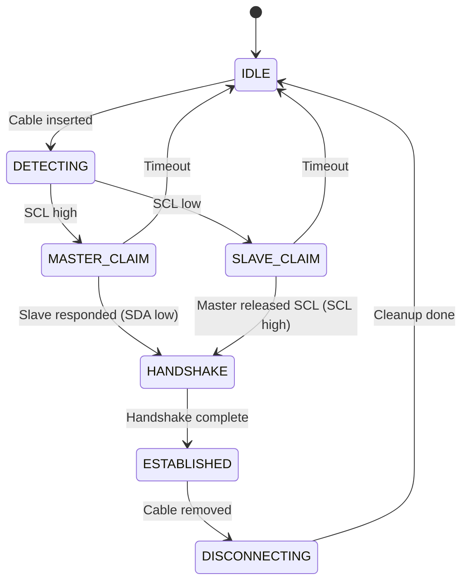
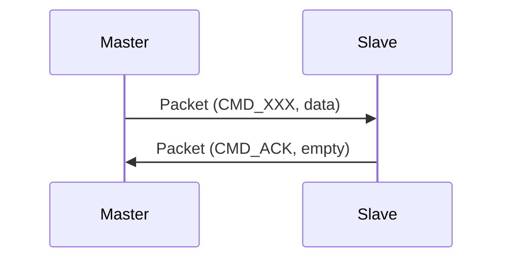
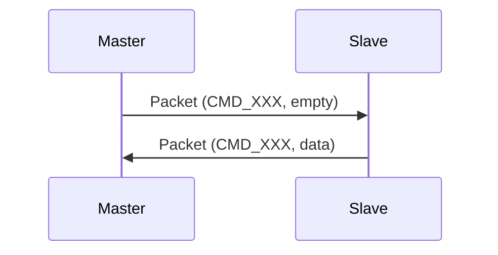
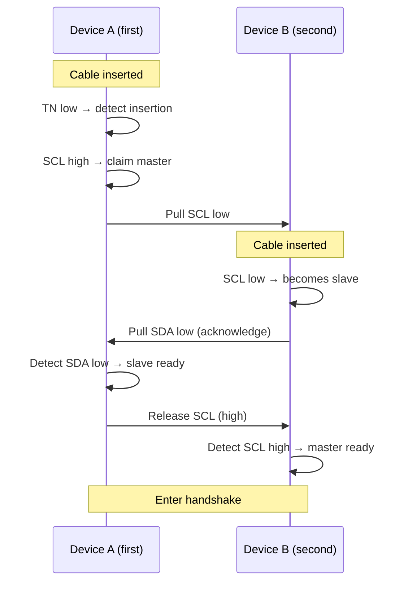
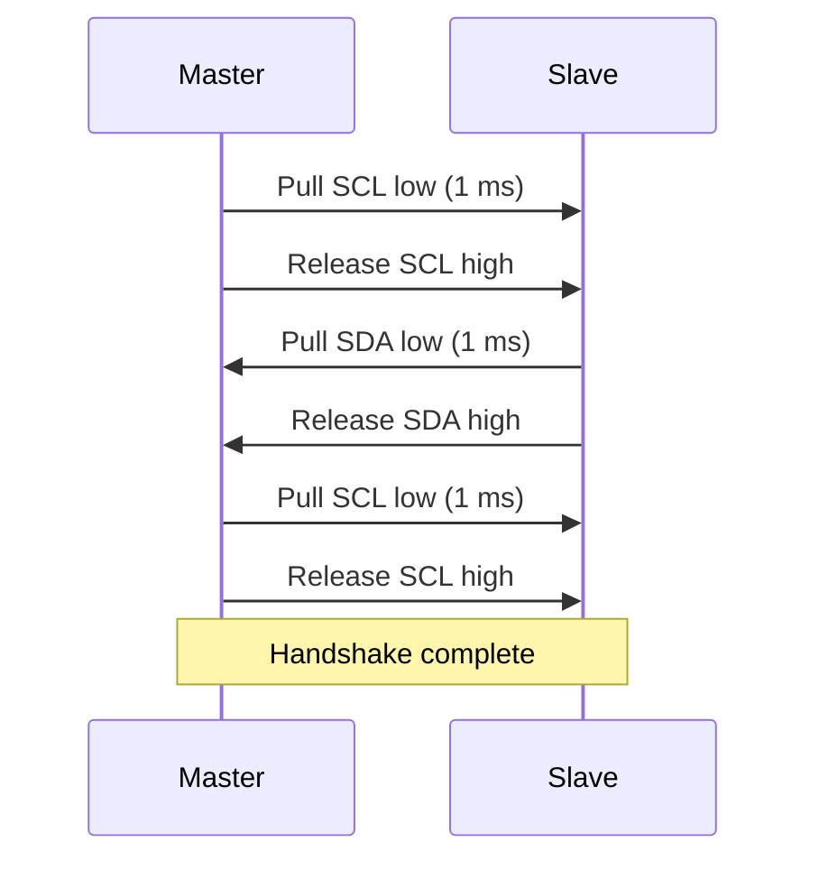
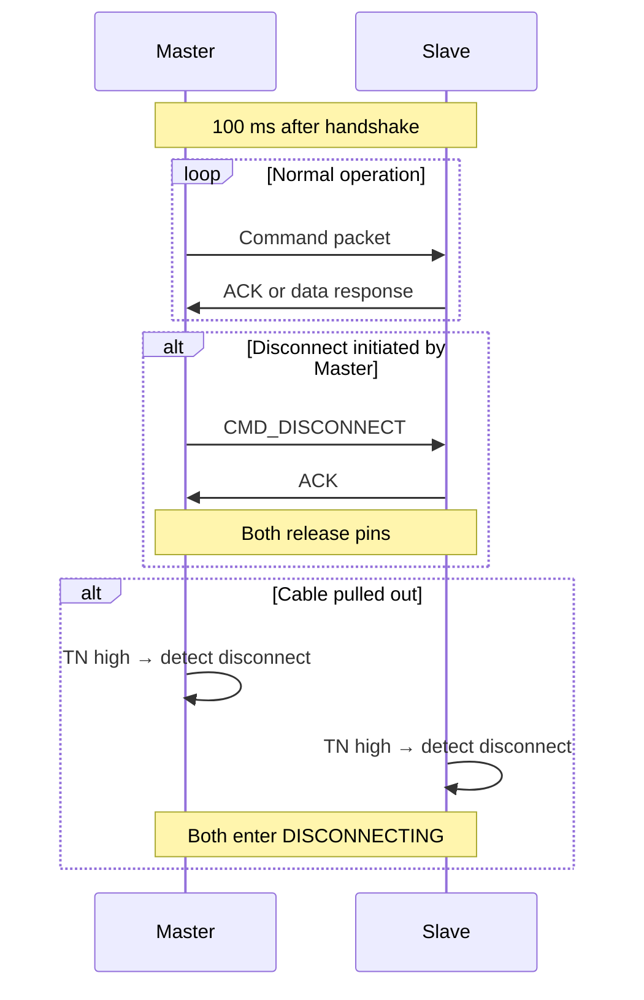

# I2C Communication Protocol Documentation

---

## 1. Overview

This document describes the communication protocol and implementation for data exchange between two **i.MX RT1011** devices over a 3.5mm audio jack. The system supports dynamic master/slave negotiation, reliable packet-based data transfer, and asynchronous file transmission.

### 1.1 Key Features

| Feature | Description |
| :--- | :--- |
| Dynamic Master/Slave Negotiation | The device that plugs in first automatically becomes the master. |
| Physical Connection Detection | Real-time cable detection via GPIO_AD_07 (TN pin). |
| Reliable Packet Protocol | CRC16 checksum ensures data integrity. |
| I2C Data Exchange | Standard 100 kHz rate. |
| Asynchronous File Transfer | Non-blocking design with progress tracking. |
| Hot-plug Support | Automatic disconnection detection and recovery. |

### 1.2 Pin Definitions (RT1011 80-pin LQFP)

| Pin Name | Physical Pin | GPIO Port | Pin Number | Definition |
| :--- | :--- | :--- | :--- | :--- |
| **GPIO_AD_09** | 48 | GPIO1 | 23 | I2C SDA |
| **GPIO_AD_10** | 47 | GPIO1 | 24 | I2C SCL |
| **GPIO_AD_07** | 51 | GPIO1 | 21 | TN (Tip Normal) |
| **GPIO_AD_08** | 49 | GPIO1 | 22 | RN (Ring Normal) |
| **GND** | 16, 30, 54, 78 | — | — | Common ground |

---

## 2. Hardware Interface

### 2.1 Pin Assignment

Both RT1011 devices use identical pin assignments for symmetric operation.

| Audio Jack Pin | RT1011 GPIO | Function | Pull Configuration |
| :--- | :--- | :--- | :--- |
| T (Tip) | GPIO_AD_09 (Pin 23) | I2C SDA | 4.7 kΩ pull-up to 3.3 V |
| R (Ring) | GPIO_AD_10 (Pin 24) | I2C SCL | 4.7 kΩ pull-up to 3.3 V |
| S (Sleeve) | GND | Common ground | Direct connection |
| RN (Ring Normal) | GPIO_AD_08 (Pin 22) | Cable detection (SCL side) | 100 kΩ pull-down to GND |
| TN (Tip Normal) | GPIO_AD_07 (Pin 21) | Cable detection (SDA side) | 100 kΩ pull-down to GND |

### 2.2 Connection Detection Logic

| State | TN/RN Level | Meaning |
| :--- | :--- | :--- |
| No cable inserted | High (3.3 V, from pull-up) | No connection |
| Cable inserted | Low (0 V, from pull-down) | Connection established |
| Cable removed | High (3.3 V, restored by pull-up) | Connection lost |

> **Note:** Detection uses stable DC levels, not transient pulses, so no software debouncing is required.

### 2.3 Electrical Characteristics

| Parameter | Value | Condition |
| :--- | :--- | :--- |
| I2C bus voltage | 3.3 V | VDDIO |
| I2C communication speed | 100 kHz | Standard mode |
| Pull-up resistors | 4.7 kΩ ± 5% | SDA and SCL lines |
| Pull-down resistors | 100 kΩ ± 5% | RN and TN lines |
| Recommended cable length | ≤ 1 m | Longer may cause signal distortion |
| Logic low (VIL) | ≤ 0.8 V | 3.3 V logic |
| Logic high (VIH) | ≥ 2.0 V | 3.3 V logic |

---

## 3. Communication Protocol

### 3.1 Packet Structure

All packets follow a unified format for reliable transmission.

| Field | Offset | Size | Endianness | Description |
| :--- | :--- | :--- | :--- | :--- |
| `Length` | 0 | 2 | Big-endian | Number of data bytes (0–480) |
| `Command` | 2 | 1 | N/A | Operation code (see section 3.2) |
| `Data` | 3 | N | N/A | Application payload (0–480 bytes) |
| `Checksum` | 3+N | 4 | Big-endian | CRC16 of the data (extended to 32 bits, only lower 16 bits used) |

### 3.2 Command Codes

| Command | Value | Direction | Description |
| :--- | :--- | :--- | :--- |
| `CMD_HANDSHAKE` | 0x01 | Bidirectional | Handshake initiation |
| `CMD_ACK` | 0x02 | Bidirectional | Positive acknowledgment |
| `CMD_NACK` | 0x03 | Bidirectional | Negative acknowledgment |
| `CMD_PING` | 0x04 | Master → Slave | Keep-alive / heartbeat |
| `CMD_STATUS` | 0x05 | Master → Slave | Query device status |
| `CMD_RESET` | 0x06 | Master → Slave | Reset remote device |
| `CMD_FILE_DATA` | 0x10 | Master → Slave | File data chunk |
| `CMD_FILE_END` | 0x11 | Master → Slave | End of file transmission |
| `CMD_FILE_REQ` | 0x12 | Master → Slave | Request a file |
| `CMD_FILE_RESP` | 0x13 | Slave → Master | File request response |
| `CMD_FILE_INFO` | 0x14 | Master → Slave | File metadata (name/size query) |
| `CMD_FILE_START` | 0x15 | Master → Slave | Start file transfer |
| `CMD_KEY_EVENT` | 0x20 | Bidirectional | Key event |
| `CMD_KEY_SCAN` | 0x21 | Master → Slave | Key scan request |
| `CMD_GPIO_SET` | 0x30 | Master → Slave | Set remote GPIO output |
| `CMD_GPIO_GET` | 0x31 | Master → Slave | Read remote GPIO input |
| `CMD_GPIO_CFG` | 0x32 | Master → Slave | Configure remote GPIO direction |
| `CMD_GET_TIME` | 0x40 | Master → Slave | Get remote timestamp |
| `CMD_SET_TIME` | 0x41 | Master → Slave | Set remote timestamp |
| `CMD_GET_INFO` | 0x42 | Master → Slave | Get device information |
| `CMD_REBOOT` | 0x43 | Master → Slave | Reboot remote device |
| `CMD_DISCONNECT` | 0xFF | Bidirectional | Graceful disconnect |

### 3.3 File Metadata Structure

When sending `CMD_FILE_START` (0x15), the data field contains the following structure:

```cpp
struct __attribute__((packed)) FileMeta {
    uint32_t total_size;   // Total file size in bytes
    uint8_t  filename[32]; // 8.3 format filename (max 31 chars)
    uint8_t  reserved[3];  // Reserved for future use
};
```

When sending `CMD_FILE_INFO` (0x14), the data field contains a plain-text filename (without path) for file queries and listing.

---

## 4. State Machine

### 4.1 State Definitions

| State | Description |
| :--- | :--- |
| `IDLE` | Waiting for cable insertion |
| `DETECTING` | Cable detected, determining role |
| `MASTER_CLAIM` | Claiming master role (pulling SCL low) |
| `SLAVE_CLAIM` | Claiming slave role (pulling SDA low) |
| `HANDSHAKE` | Performing 3-step handshake |
| `ESTABLISHED` | I2C link established and ready |
| `DISCONNECTING` | Graceful teardown |

### 4.2 State Transition Diagram


```mermaid
stateDiagram-v2
    [*] --> IDLE

    IDLE --> DETECTING: Cable inserted

    DETECTING --> MASTER_CLAIM: SCL high
    DETECTING --> SLAVE_CLAIM: SCL low

    MASTER_CLAIM --> HANDSHAKE: Slave responded (SDA low)
    MASTER_CLAIM --> IDLE: Timeout

    SLAVE_CLAIM --> HANDSHAKE: Master released SCL (SCL high)
    SLAVE_CLAIM --> IDLE: Timeout

    HANDSHAKE --> ESTABLISHED: Handshake complete

    ESTABLISHED --> DISCONNECTING: Cable removed

    DISCONNECTING --> IDLE: Cleanup done
```

### 4.3 Role Negotiation Procedure

**Master Detection (first plug-in):**

1. Device detects cable insertion (TN goes low).
2. Reads SCL (GPIO_AD_10 / Pin 24) level:
   - **High**: No master on the bus → This device claims master.
   - **Low**: A master is already present → This device becomes slave.

**Master Claim Procedure:**

| Step | Master Action | Slave Action |
| :--- | :--- | :--- |
| 1 | Pull SCL low | Wait for SCL low |
| 2 | Wait for SDA low | Pull SDA low (acknowledge) |
| 3 | Release SCL (pull high) | Detect SCL high |
| 4 | Enter handshake | Enter handshake |

### 4.4 Handshake Procedure

The 3-step handshake confirms bidirectional communication and synchronises the devices.

**Master Side:**

| Step | Duration | Action |
| :--- | :--- | :--- |
| 1 | 1 ms | Pull SCL low |
| 2 | — | Release SCL (pull high) |
| 3 | Wait | Detect SDA low (slave response) |
| 4 | Wait | Detect SDA high (response ended) |
| 5 | 1 ms | Pull SCL low |
| 6 | — | Release SCL (pull high) |

**Slave Side:**

| Step | Duration | Action |
| :--- | :--- | :--- |
| 1 | Wait | Detect SCL low |
| 2 | — | Detect SCL high |
| 3 | 1 ms | Pull SDA low |
| 4 | — | Release SDA (pull high) |
| 5 | Wait | Detect SCL low |
| 6 | — | Detect SCL high |

---

## 5. Data Transfer

### 5.1 Packet Exchange Flow

**Master sends data to Slave:**


```mermaid
sequenceDiagram
    participant Master
    participant Slave
    Master->>Slave: Packet (CMD_XXX, data)
    Slave->>Master: Packet (CMD_ACK, empty)
```

**Master requests data from Slave:**


```mermaid
sequenceDiagram
    participant Master
    participant Slave
    Master->>Slave: Packet (CMD_XXX, empty)
    Slave->>Master: Packet (CMD_XXX, data)
```

### 5.2 File Transfer Protocol

**Sender (Master):**

| Step | Packet Type | Data Content | Description |
| :--- | :--- | :--- | :--- |
| 1 | `CMD_FILE_START` | FileMeta | File metadata (size, name) |
| 2..N | `CMD_FILE_DATA` | Data chunks | File content (≤480 bytes each) |
| N+1 | `CMD_FILE_END` | Empty | End-of-file marker |

**Receiver (Slave):**

| Step | Action | Description |
| :--- | :--- | :--- |
| 1 | Receive `CMD_FILE_START` | Extract metadata, prepare file |
| 2 | Receive `CMD_FILE_DATA` | Append chunk to file, update progress |
| 3 | Receive `CMD_FILE_END` | Finalise file, mark transfer complete |

### 5.3 Asynchronous File Transfer

File transfers are processed **asynchronously** to avoid blocking the main application loop.

---

## 6. API Reference

### 6.1 I2CLink Class

```cpp
namespace commu {
class I2CLink {
public:
    I2CLink(I2C_Type *i2c = LPI2C1, uint8_t addr = 0x42);

    // Pin initialisation
    void init_pins(uint32_t sda = 23, uint32_t scl = 24,
                   uint32_t rn = 22, uint32_t tn = 21);

    // Connection detection
    bool is_cable_inserted() const;
    bool is_scl_high() const;
    bool is_sda_high() const;

    // Role negotiation
    bool claim_master(uint32_t timeout_ms = 500);
    bool claim_slave(uint32_t timeout_ms = 500);
    bool handshake_master(uint32_t timeout_ms = 5000);
    bool handshake_slave(uint32_t timeout_ms = 5000);

    // Master/Slave mode
    void enable_master(uint32_t baudrate = 100 * 1000);
    void enable_slave(i2c_slave_callback_t callback = nullptr,
                      void* user_data = nullptr);

    // I2C operations
    bool master_write(const uint8_t* data, size_t len);
    bool master_read(uint8_t* buf, size_t len, uint32_t timeout_ms = 100);

    // Slave buffers
    void slave_set_tx_data(const uint8_t* data, size_t len);
    const std::vector<uint8_t>& slave_get_rx_data() const;
    void slave_clear_rx_data();

    // Disconnect
    void disconnect();

    // Getters
    bool is_slave_ready() const;
    bool is_master_ready() const;
};
}
```

### 6.2 FileTransfer Class

```cpp
namespace commu {
class FileTransfer {
public:
    FileTransfer(I2CLink &link, SDCard::FATFS *fatfs);

    // Asynchronous send/receive
    bool send_file(const char *filename, TransferCallback callback = nullptr);
    bool recv_file(const char *filename, TransferCallback callback = nullptr);

    void cancel();
    TransferStatus get_status() const;
    void process();  // Call in main loop
};
}
```

### 6.3 TransferStatus Structure

```cpp
struct TransferStatus {
    TransferDirection direction;   // SEND, RECEIVE, or IDLE
    uint32_t total_bytes;
    uint32_t bytes_transferred;
    uint32_t progress_percent;     // 0–100
    bool is_active;
    bool is_complete;
    bool has_error;
    bool cancel_requested;
    char filename[32];
};
```

---

## 7. Usage Examples

### 7.1 Basic Communication Setup

```cpp
#include "commu/commu_i2c_link.hpp"

commu::I2CLink link(LPI2C1, 0x42);

int main() {
    link.init_pins();

    while (true) {
        if (link.is_cable_inserted()) {
            if (link.is_scl_high()) {
                // Master mode
                link.enable_master();
                if (link.claim_master() && link.handshake_master()) {
                    // Link established
                }
            } else {
                // Slave mode
                link.enable_slave();
                if (link.claim_slave() && link.handshake_slave()) {
                    // Link established
                }
            }
        }
    }
}
```

### 7.2 File Transfer with Progress Display

```cpp
#include "commu/file_transfer.hpp"
#include "dispinterface/stddisplay.hpp"

extern Display::RedTFTdisp display;
extern GFXfont Arial_14;

commu::FileTransfer ft(link, &fatfs);

void update_display() {
    auto status = ft.get_status();

    display.ClearScreen(RGB565_BLACK);

    if (status.is_active) {
        // Filename
        display.DrawTextF(0, 0, &Arial_14, 1,
                          "%lFile: %s%l", RGB565_CYAN, status.filename, RGB565_WHITE);

        // Progress percentage
        char buf[16];
        snprintf(buf, sizeof(buf), "%lu%%", status.progress_percent);
        display.DrawTextF(60, 25, &Arial_14, 2,
                          "%l%s%l", RGB565_GREEN, buf, RGB565_WHITE);

        // Progress bar
        int fill = (status.progress_percent * 140) / 100;
        display.DrawRect(10, 50, 140, 10, RGB565_GRAY);
        if (fill > 0) {
            display.DrawRect(11, 51, fill - 2, 8, RGB565_GREEN);
        }

    } else if (status.is_complete) {
        display.DrawTextF(0, 30, &Arial_14, 2,
                          "%lTransfer Complete!%l", RGB565_GREEN, RGB565_WHITE);
    } else if (status.has_error) {
        display.DrawTextF(0, 30, &Arial_14, 2,
                          "%lTransfer Failed!%l", RGB565_RED, RGB565_WHITE);
    }
}

int main() {
    display.InitPin();
    display.InitDisplay();
    display.ClearScreen(RGB565_BLACK);

    ft.init();

    while (true) {
        ft.process();
        update_display();
        sleep_ms(20);
    }
}
```

### 7.3 Sending Key Events via Audio Link

```cpp
// Master sends key code to slave
if (link.is_master_ready()) {
    uint8_t key_code = 0x12;
    link.master_write(&key_code, 1);
}
```

---

## 8. File Structure

```text
inc/
├── gpio_rt1011.hpp              // GPIO abstraction layer
├── keypadio.hpp                 // Matrix keypad driver
└── commu/
    ├── commu_types.hpp          // Types, command codes
    ├── commu_crc.hpp            // CRC16 implementation
    ├── commu_packet.hpp         // Packet builder/parser
    ├── commu_queue.hpp          // Lock-free ring buffer
    ├── commu_i2c_link.hpp       // I2C physical layer (with Slave)
    └── file_transfer.hpp        // Asynchronous file transfer
```

---

## 9. Error Handling

### 9.1 Connection Monitoring

- GPIO_AD_07 (TN) is continuously monitored.
- All operations check the connection state before proceeding.
- On disconnection, the state machine transitions to `DISCONNECTING` and shuts down the link gracefully.

### 9.2 Timeouts

| Operation | Timeout | Action |
| :--- | :--- | :--- |
| Role negotiation | 500 ms | Return to `IDLE` |
| Handshake | 5 s | Return to `IDLE` |
| Packet receive | Configurable (default 100 ms) | Return failure |

### 9.3 Error Recovery

| Error Type | Recovery Action |
| :--- | :--- |
| Checksum error | Discard packet, wait for retransmission |
| I2C NAK | Retry (up to 3 times) |
| Disconnection | Clear state, return to `IDLE` |
| SD card error | Mark transfer as error |

---

## 10. Communication Process & Details

### 10.1 Cable Insertion and Role Negotiation


```mermaid
sequenceDiagram
    participant A as Device A (first)
    participant B as Device B (second)

    Note over A: Cable inserted
    A->>A: TN low → detect insertion
    A->>A: SCL high → claim master
    A->>B: Pull SCL low
    Note over B: Cable inserted
    B->>B: SCL low → becomes slave
    B->>A: Pull SDA low (acknowledge)
    A->>A: Detect SDA low → slave ready
    A->>B: Release SCL (high)
    B->>B: Detect SCL high → master ready
    Note over A,B: Enter handshake
```

### 10.2 Handshake (3-step pulse exchange)


```mermaid
sequenceDiagram
    participant Master
    participant Slave

    Master->>Slave: Pull SCL low (1 ms)
    Master->>Slave: Release SCL high
    Slave->>Master: Pull SDA low (1 ms)
    Slave->>Master: Release SDA high
    Master->>Slave: Pull SCL low (1 ms)
    Master->>Slave: Release SCL high
    Note over Master,Slave: Handshake complete
```

### 10.3 I2C Communication and Disconnection


```mermaid
sequenceDiagram
    participant Master
    participant Slave

    Note over Master,Slave: 100 ms after handshake

    loop Normal operation
        Master->>Slave: Command packet
        Slave->>Master: ACK or data response
    end

    alt Disconnect initiated by Master
        Master->>Slave: CMD_DISCONNECT
        Slave->>Master: ACK
        Note over Master,Slave: Both release pins
    end

    alt Cable pulled out
        Master->>Master: TN high → detect disconnect
        Slave->>Slave: TN high → detect disconnect
        Note over Master,Slave: Both enter DISCONNECTING
    end
```

### 10.4 Detailed Procedure Description

#### 10.4.1 Cable Insertion

1. Device A inserts the cable. The internal switches open in order: `R-RN` then `T-TN`, making GPIO_AD_08 and GPIO_AD_07 go low. When GPIO_AD_07 goes low, insertion is confirmed. Device A reads SCL (GPIO_AD_10) – it is high (pulled up by R5), so A becomes the master.

2. Device A pulls SCL (GPIO_AD_10) low and keeps it low, while monitoring SDA (GPIO_AD_09) and GPIO_AD_07 (TN). If GPIO_AD_07 returns high, the physical connection is broken.

3. Device B inserts the cable. The same sequence occurs: GPIO_AD_08 and GPIO_AD_07 go low. When GPIO_AD_07 is low, B reads SCL (GPIO_AD_10) – it is low, so B becomes the slave.

4. Device B pulls SDA (GPIO_AD_09) low and keeps it low, while monitoring SCL (GPIO_AD_10) and GPIO_AD_07 (TN).

5. Device A detects SDA low (GPIO_AD_09 low) – this confirms the slave is online – and then releases SCL (sets it high).

6. Device B detects SCL high – this confirms the master is ready – and then releases SDA (sets it high).

At this point the connection is established.

#### 10.4.2 Handshake

During the handshake, both devices continuously monitor GPIO_AD_07. If it goes high, the connection is lost and they must abort.

1. Master A pulls SCL low for 1 ms, then releases it high.

2. Slave B, upon detecting the pulse, pulls SDA low for 1 ms, then releases it high.

3. Master A, upon detecting the slave's pulse, pulls SCL low again for 1 ms, then releases it high.

4. Handshake ends.

#### 10.4.3 I2C Communication

During communication, GPIO_AD_07 is continuously monitored. If it goes high, the connection is broken; any ongoing SD card operation must be aborted or rolled back.

1. 100 ms after the handshake, I2C communication begins.

2. Data transfer mimics TCP-style semantics.

3. When the master has no pending operation, it polls the slave; when the master has a command, it sends a packet directly.

#### 10.4.4 Termination

1. Either side may initiate a disconnect by sending a termination packet. Upon receiving it, the other side enters the standby state. When the master has finished transferring all data, it sends a disconnect command and both sides end I2C communication.

2. After 100 ms, the master pulls SCL low and the slave pulls SDA low.

3. If either side detects GPIO_AD_07 high, it knows its own cable has been removed and ends communication.

4. If a side detects that the other side's line is high (i.e., the other side has removed its cable), it notifies the user to unplug the cable. When GPIO_AD_07 is high, its own cable is removed and the communication ends.

---

> Edt: 8.28
