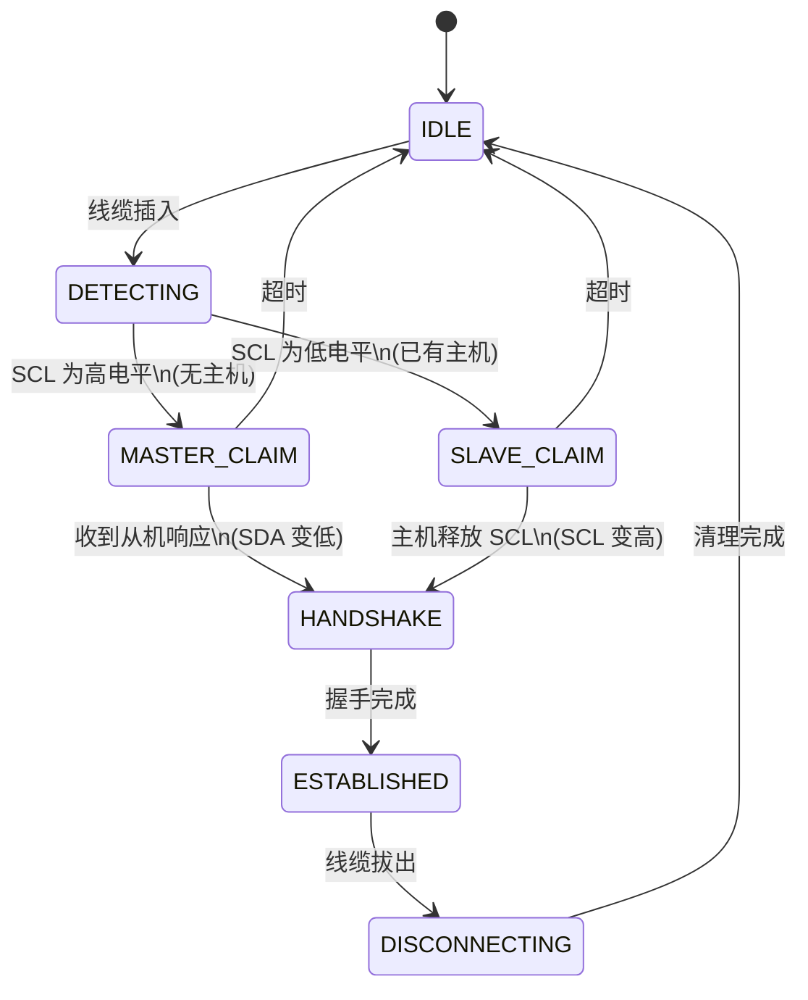
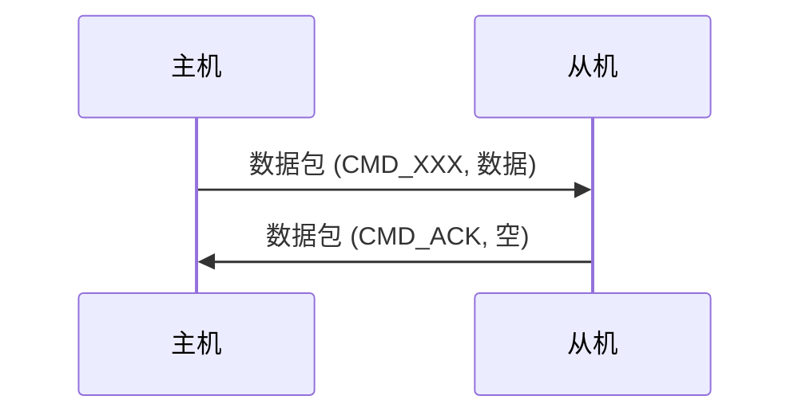
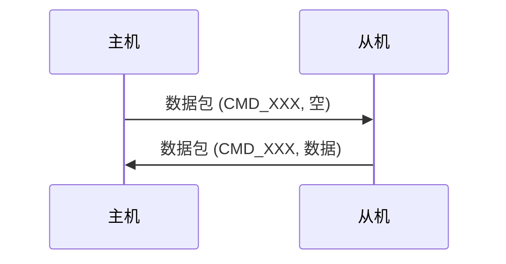
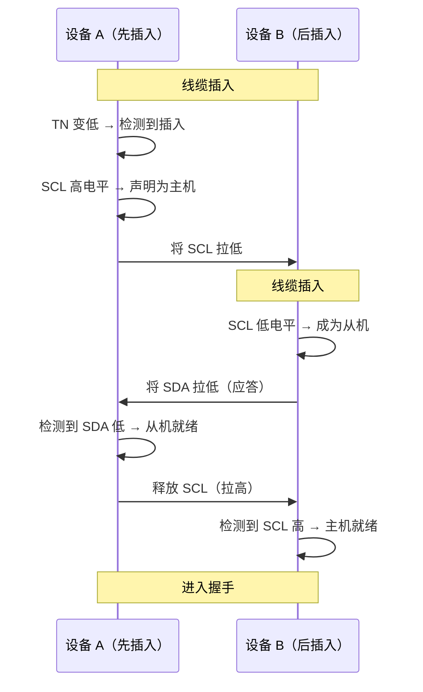
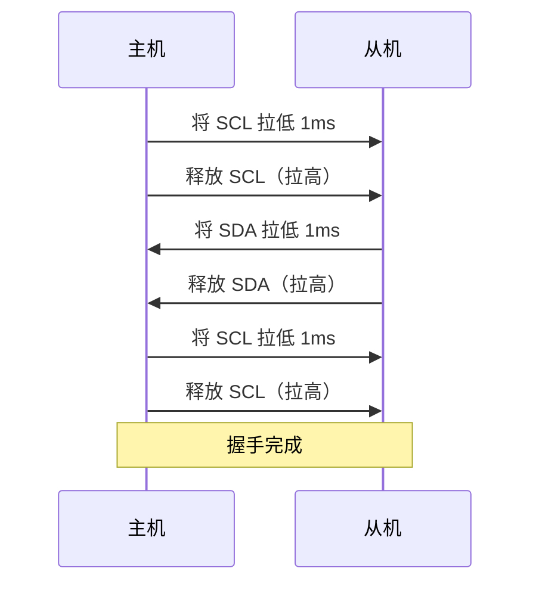
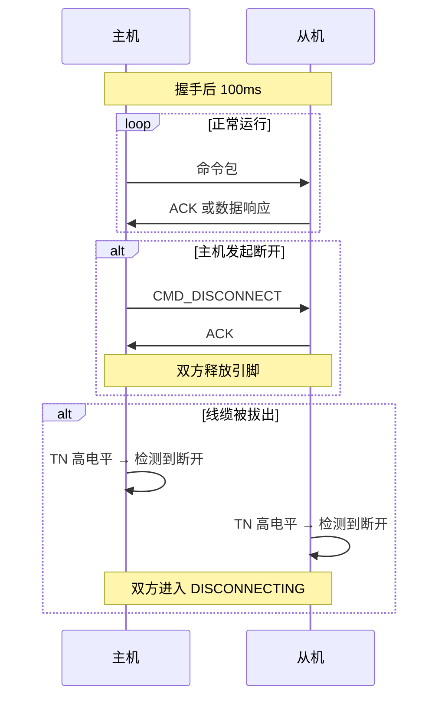

# I2C 通信协议文档

---

## 1. 概述

本文档描述了两个 Raspberry Pi Pico 设备之间通过 3.5mm 音频接口进行数据交换的通信协议与实现方案。系统支持动态主从协商、基于数据包的可靠传输以及异步文件传输。

### 1.1 主要特性

| 特性 | 说明 |
| :--- | :--- |
| 动态主从协商 | 先插入音频线的一方自动成为主机 |
| 物理连接检测 | 通过 GPIO7（TN 引脚）实时检测线缆插拔 |
| 可靠数据包协议 | 支持 CRC16 校验，确保数据完整性 |
| I2C 数据交换 | 100 kHz 标准速率 |
| 异步文件传输 | 双核并行，支持进度跟踪 |
| 双核架构 | 核心0：主循环/UI；核心1：文件传输 |
| 热插拔支持 | 实时检测连接断开并自动恢复 |

### 1.2 引脚定义表

| 引脚 | 定义 |
| :--- | :--- |
| **TN** | Tip Normal，音频插座尖端常闭开关触点 |
| **RN** | Ring Normal，音频插座环部常闭开关触点 |
| **T** | Tip，音频插头尖端，用作 I2C SDA |
| **R** | Ring，音频插头环部，用作 I2C SCL |
| **S** | Sleeve，音频插头套筒，用作 GND |

---

## 2. 硬件接口

### 2.1 引脚分配

两台 Pico 使用完全相同的引脚分配，实现对称操作。

| 音频插座引脚 | Pico GPIO | 功能 | 上拉/下拉配置 |
| :--- | :--- | :--- | :--- |
| T (Tip) | GPIO4 | I2C SDA | 4.7kΩ 上拉至 3.3V |
| R (Ring) | GPIO5 | I2C SCL | 4.7kΩ 上拉至 3.3V |
| S (Sleeve) | GND | 公共地 | 直接连接 |
| RN (Ring Normal) | GPIO6 | 线缆检测（SCL 侧） | 100kΩ 下拉至 GND |
| TN (Tip Normal) | GPIO7 | 线缆检测（SDA 侧） | 100kΩ 下拉至 GND |

### 2.2 连接检测逻辑

| 状态 | TN/RN 电平 | 含义 |
| :--- | :--- | :--- |
| 未插入线缆 | 高电平（3.3V，由上拉电阻提供） | 无连接 |
| 已插入线缆 | 低电平（0V，由下拉电阻拉低） | 连接已建立 |
| 线缆被拔出 | 高电平（3.3V，由上拉电阻恢复） | 连接断开 |

> **注意**：检测使用稳定的直流电平而非瞬态脉冲，因此无需软件消抖处理。

### 2.3 电气特性

| 参数 | 数值 | 条件 |
| :--- | :--- | :--- |
| I2C 总线电压 | 3.3V | VDDIO |
| I2C 通信速率 | 100 kHz | 标准模式 |
| 上拉电阻 | 4.7 kΩ ± 5% | SDA 和 SCL 线 |
| 下拉电阻 | 100 kΩ ± 5% | RN 和 TN 线 |
| 推荐线缆长度 | ≤ 1 米 | 超过可能信号失真 |
| 逻辑低电平 (VIL) | ≤ 0.8V | 3.3V 逻辑 |
| 逻辑高电平 (VIH) | ≥ 2.0V | 3.3V 逻辑 |

---

## 3. 通信协议

### 3.1 数据包结构

所有数据包遵循统一格式，确保可靠传输。

| 字段 | 偏移 | 大小 | 字节序 | 描述 |
| :--- | :--- | :--- | :--- | :--- |
| `长度` | 0 | 2 | 大端 | 数据字节数（0–480） |
| `命令码` | 2 | 1 | N/A | 操作代码（见第 3.2 节） |
| `数据` | 3 | N | N/A | 应用层有效载荷（0–480 字节） |
| `校验和` | 3+N | 4 | 大端 | 数据的 CRC16 校验值（扩展至 32 位，仅低 16 位有效） |

### 3.2 命令码

| 命令码 | 值 | 方向 | 描述 |
| :--- | :--- | :--- | :--- |
| `CMD_HANDSHAKE` | 0x01 | 双向 | 握手发起 |
| `CMD_ACK` | 0x02 | 双向 | 肯定应答 |
| `CMD_NACK` | 0x03 | 双向 | 否定应答 |
| `CMD_PING` | 0x04 | 主机 → 从机 | 心跳保活 |
| `CMD_STATUS` | 0x05 | 主机 → 从机 | 查询设备状态 |
| `CMD_RESET` | 0x06 | 主机 → 从机 | 复位远端设备 |
| `CMD_FILE_DATA` | 0x10 | 主机 → 从机 | 文件数据块 |
| `CMD_FILE_END` | 0x11 | 主机 → 从机 | 文件传输结束 |
| `CMD_FILE_REQ` | 0x12 | 主机 → 从机 | 请求文件 |
| `CMD_FILE_RESP` | 0x13 | 从机 → 主机 | 文件请求响应 |
| `CMD_FILE_INFO` | 0x14 | 主机 → 从机 | 文件元数据（文件名/大小查询） |
| `CMD_FILE_START` | 0x15 | 主机 → 从机 | 开始文件传输 |
| `CMD_KEY_EVENT` | 0x20 | 双向 | 按键事件 |
| `CMD_KEY_SCAN` | 0x21 | 主机 → 从机 | 按键扫描请求 |
| `CMD_GPIO_SET` | 0x30 | 主机 → 从机 | 设置远端 GPIO 输出 |
| `CMD_GPIO_GET` | 0x31 | 主机 → 从机 | 读取远端 GPIO 输入 |
| `CMD_GPIO_CFG` | 0x32 | 主机 → 从机 | 配置远端 GPIO 方向 |
| `CMD_GET_TIME` | 0x40 | 主机 → 从机 | 获取远端时间戳 |
| `CMD_SET_TIME` | 0x41 | 主机 → 从机 | 设置远端时间戳 |
| `CMD_GET_INFO` | 0x42 | 主机 → 从机 | 获取设备信息 |
| `CMD_REBOOT` | 0x43 | 主机 → 从机 | 重启远端设备 |
| `CMD_DISCONNECT` | 0xFF | 双向 | 优雅断开连接 |

### 3.3 文件元数据结构

当发送 `CMD_FILE_START`（0x15）时，数据字段包含以下结构：

```cpp
struct __attribute__((packed)) FileMeta {
    uint32_t total_size;   // 文件总大小（字节）
    uint8_t  filename[32]; // 8.3 格式文件名（最多 31 字符）
    uint8_t  reserved[3];  // 保留供将来使用
};
```

当发送 `CMD_FILE_INFO`（0x14）时，数据字段为纯文本文件名（不包含路径），用于文件查询和列表操作。

---

## 4. 状态机

### 4.1 状态定义

| 状态 | 描述 |
| :--- | :--- |
| `IDLE` | 等待线缆插入 |
| `DETECTING` | 检测到线缆，正在确定角色 |
| `MASTER_CLAIM` | 正在声明主机角色（将 SCL 拉低） |
| `SLAVE_CLAIM` | 正在声明从机角色（将 SDA 拉低） |
| `HANDSHAKE` | 正在执行 4 步握手 |
| `ESTABLISHED` | I2C 链路已建立并就绪 |
| `DISCONNECTING` | 正在优雅断开连接 |

### 4.2 状态转换图



### 4.3 角色协商流程

**主机检测（先插入者）：**

1. 设备检测到线缆插入（TN 变为低电平）
2. 读取 SCL（GPIO5）电平：
   - **高电平**：总线上无主机 → 本设备声明为主机
   - **低电平**：已有主机 → 本设备成为从机

**主机声明流程：**

| 步骤 | 主机操作 | 从机操作 |
| :--- | :--- | :--- |
| 1 | 将 SCL 拉低 | 等待 SCL 变低 |
| 2 | 等待 SDA 变低 | 将 SDA 拉低（应答） |
| 3 | 释放 SCL（拉高） | 检测 SCL 变高 |
| 4 | 进入握手阶段 | 进入握手阶段 |

### 4.4 握手流程

4 步握手用于确认双向通信正常并使设备同步。

**主机侧：**

| 步骤 | 持续时间 | 操作 |
| :--- | :--- | :--- |
| 1 | 0–1 ms | 将 SCL 拉低 |
| 2 | 1 ms | 释放 SCL（拉高） |
| 3 | 等待 | 检测 SDA 变低（从机响应） |
| 4 | 等待 | 检测 SDA 变高（响应结束） |
| 5 | 1 ms | 将 SCL 拉低 |
| 6 | 1 ms | 释放 SCL（拉高） |
| 7 | — | 握手完成 |

**从机侧：**

| 步骤 | 持续时间 | 操作 |
| :--- | :--- | :--- |
| 1 | 等待 | 检测 SCL 变低（主机脉冲开始） |
| 2 | 1 ms | 检测 SCL 变高（脉冲结束） |
| 3 | 1 ms | 将 SDA 拉低 |
| 4 | 1 ms | 释放 SDA（拉高） |
| 5 | 等待 | 检测 SCL 变低（第二脉冲开始） |
| 6 | 1 ms | 检测 SCL 变高（第二脉冲结束） |
| 7 | — | 握手完成 |

---

## 5. 数据传输

### 5.1 数据包交换流程

**主机发送数据到从机：**



**主机从从机请求数据：**



### 5.2 文件传输协议

**发送端（主机）：**

| 步骤 | 数据包类型 | 数据内容 | 描述 |
| :--- | :--- | :--- | :--- |
| 1 | `CMD_FILE_START` | FileMeta | 文件元数据（大小、名称） |
| 2..N | `CMD_FILE_DATA` | 数据块 | 文件内容（≤480 字节/块） |
| N+1 | `CMD_FILE_END` | 空 | 文件结束标记 |

**接收端（从机）：**

| 步骤 | 操作 | 描述 |
| :--- | :--- | :--- |
| 1 | 接收 `CMD_FILE_START` | 提取元数据，准备文件 |
| 2 | 接收 `CMD_FILE_DATA` | 追加数据块到文件，更新进度 |
| 3 | 接收 `CMD_FILE_END` | 完成文件写入，标记传输完成 |

### 5.3 异步文件传输

文件传输在 **核心 1** 上处理，避免阻塞 **核心 0** 上的主应用循环。

**核心 1 职责：**

- 从/向 SD 卡读写数据
- 数据包分片与重组
- 进度跟踪与状态更新

**核心 0 职责：**

- 通信状态机
- 用户界面/屏幕更新
- 命令处理
- 用户输入处理

---

## 6. API 参考

### 6.1 AudioCommu 类

```cpp
namespace commu {
class AudioCommu {
public:
    AudioCommu(I2CLink &link, Checksum *chk = nullptr);

    /** 初始化通信模块 */
    void init();

    /** 主状态机（在主循环中调用） */
    void process();

    /** 检查 I2C 链路是否已建立 */
    bool is_connected() const;

    /** 检查本设备是否为主机 */
    bool is_master() const;

    /** 发送数据包（仅主机可用） */
    bool send_packet(uint8_t cmd, const uint8_t *data, size_t data_len);

    /** 接收数据包（阻塞，带超时） */
    bool recv_packet(uint8_t &cmd, uint8_t *buf, size_t &data_len,
                     uint32_t timeout_ms = 100);

    /** 发送按键事件 */
    bool send_key_event(uint8_t key_code);

    /** 获取 RX 队列（供从机回调使用） */
    PacketQueue<8>& rx_queue();

    /** 获取 TX 队列（供从机回调使用） */
    PacketQueue<8>& tx_queue();
};
}
```

### 6.2 FileTransfer 类

```cpp
namespace commu {
class FileTransfer {
public:
    FileTransfer(AudioCommu &comm, SDCard::FATFS *fatfs);

    /** 初始化核心 1 工作线程 */
    void init_core1();

    /** 异步发送文件 */
    bool send_file(const char *filename, TransferCallback callback = nullptr);

    /** 异步接收文件 */
    bool recv_file(const char *filename, TransferCallback callback = nullptr);

    /** 取消正在进行的传输 */
    void cancel();

    /** 获取当前传输状态 */
    TransferStatus get_status() const;

    /** 处理状态更新（在主循环中调用） */
    void process();
};
}
```

### 6.3 TransferStatus 结构体

```cpp
struct TransferStatus {
    TransferDirection direction;   ///< SEND、RECEIVE 或 IDLE
    uint32_t total_bytes;          ///< 文件总大小
    uint32_t bytes_transferred;    ///< 已传输字节数
    uint32_t progress_percent;     ///< 进度百分比（0–100）
    bool is_active;                ///< 传输进行中
    bool is_complete;              ///< 传输成功完成
    bool has_error;                ///< 传输失败
    bool cancel_requested;         ///< 用户请求取消
    char filename[32];             ///< 当前文件名
};
```

---

## 7. 使用示例

### 7.1 基础通信设置

```cpp
#include "commu/commu_audio.hpp"
#include "commu/commu_i2c_link.hpp"

commu::I2CLink link(i2c0, 0x42);
commu::AudioCommu comm(link);

int main() {
    stdio_init_all();
    comm.init();

    while (true) {
        comm.process();

        if (comm.is_connected()) {
            if (comm.is_master()) {
                // 主机：发送状态请求
                comm.send_packet(commu::CMD_STATUS, nullptr, 0);
            } else {
                // 从机：接收并处理
                uint8_t cmd;
                uint8_t buf[32];
                size_t len;
                if (comm.recv_packet(cmd, buf, len, 10)) {
                    // 处理命令
                }
            }
        }
        sleep_ms(10);
    }
}
```

### 7.2 带进度显示的文件传输（使用 ST7735 显示驱动）

```cpp
#include "commu/file_transfer.hpp"
#include "dispinterface/stddisplay.hpp"
#include "fonts/arial14.h"  // 假设你有一个 Arial 14 像素字体

// 假设 display 是全局的 RedTFTdisp 实例
extern Display::RedTFTdisp display;
extern GFXfont Arial_14;

commu::FileTransfer ft(comm, &fatfs);

void update_display_with_progress() {
    auto status = ft.get_status();

    // 清屏
    display.ClearScreen(RGB565_BLACK);

    // 显示标题
    display.DrawTextF(0, 0, &Arial_14, 1,
                      "%l传输中...%l", RGB565_WHITE, RGB565_YELLOW);

    if (status.is_active) {
        // 显示文件名（居中显示）
        char filename_buf[32];
        snprintf(filename_buf, sizeof(filename_buf), "文件: %s", status.filename);
        display.DrawTextF(0, 20, &Arial_14, 1,
                          "%l%s%l", RGB565_CYAN, filename_buf, RGB565_WHITE);

        // 显示进度百分比
        char progress_buf[16];
        snprintf(progress_buf, sizeof(progress_buf), "%lu%%",
                 status.progress_percent);
        display.DrawTextF(60, 40, &Arial_14, 2,
                          "%l%s%l", RGB565_GREEN, progress_buf, RGB565_WHITE);

        // 绘制进度条（使用 DrawRect）
        int bar_x = 10;
        int bar_y = 65;
        int bar_width = 140;
        int bar_height = 12;

        // 进度条背景（灰色边框）
        display.DrawRect(bar_x, bar_y, bar_width, bar_height, RGB565_GRAY);

        // 进度条填充（绿色，根据进度计算宽度）
        int fill_width = (status.progress_percent * bar_width) / 100;
        if (fill_width > 0) {
            display.DrawRect(bar_x + 1, bar_y + 1,
                             fill_width - 2, bar_height - 2,
                             RGB565_GREEN);
        }

        // 显示方向和状态
        const char* direction = status.direction == commu::TransferDirection::SEND ?
                                "发送" : "接收";
        display.DrawTextF(0, 85, &Arial_14, 1,
                          "%l方向: %s%l", RGB565_WHITE, direction, RGB565_WHITE);

    } else if (status.is_complete) {
        display.DrawTextF(0, 40, &Arial_14, 2,
                          "%l传输完成！%l", RGB565_GREEN, RGB565_WHITE);
    } else if (status.has_error) {
        display.DrawTextF(0, 40, &Arial_14, 2,
                          "%l传输失败！%l", RGB565_RED, RGB565_WHITE);
    }
}

int main() {
    stdio_init_all();

    // 初始化显示
    display.InitPin();
    display.InitDisplay();
    display.ClearScreen(RGB565_BLACK);

    // 初始化文件传输
    ft.init_core1();

    while (true) {
        comm.process();
        ft.process();

        // 更新屏幕显示
        update_display_with_progress();

        sleep_ms(20);
    }
}
```

### 7.3 按键接口使用（与 commu 分离）

`keypadio.hpp` 位于 `inc/keypadio.hpp`，不属于 commu 模块：

```cpp
#include "keypadio.hpp"

Keypad::KeypadIO keypad(i2c1, 26, 27);
keypad.init();

uint8_t row, col;
if (keypad.read(row, col)) {
    printf("按键: 行=%d, 列=%d\n", row, col);
}
```

### 7.4 通过音频链路发送按键事件（主机）

```cpp
if (comm.is_master()) {
    // 向从机发送按键码
    comm.send_key_event(0x12);  // 按键码 0x12
}
```

### 7.5 通过音频链路接收按键事件（从机）

```cpp
uint8_t cmd;
uint8_t buf[32];
size_t len;

if (comm.recv_packet(cmd, buf, len, 10)) {
    if (cmd == commu::CMD_KEY_EVENT && len == 1) {
        uint8_t key_code = buf[0];
        printf("收到按键码: 0x%02X\n", key_code);
    }
}
```

---

## 8. 文件结构

```text
项目根目录/
└── inc/
    ├── keypadio.hpp               // 按键 I2C 从机驱动（Nano 通信）
    └── commu/
        ├── commu_types.hpp        // 类型定义、命令码、校验接口
        ├── commu_crc.hpp          // CRC16 实现
        ├── commu_packet.hpp       // 数据包构造/解析
        ├── commu_queue.hpp        // 无锁环形队列
        ├── commu_i2c_link.hpp     // I2C 物理层
        ├── commu_audio.hpp        // 音频通信管理器
        └── file_transfer.hpp      // 异步文件传输
```

---

## 9. 错误处理

### 9.1 连接监控

- GPIO7（TN）持续被监控
- 所有操作在执行前检查连接状态
- 检测到断开时，状态机进入 `DISCONNECTING` 状态并优雅关闭链路

### 9.2 超时处理

| 操作 | 超时时间 | 行为 |
| :--- | :--- | :--- |
| 角色协商 | `500 ms` | 返回 `IDLE` 状态 |
| 握手 | `5 s` | 返回 `IDLE` 状态 |
| 数据包接收 | 可配置（默认 100 ms） | 返回失败 |
| 文件传输 | 无超时 | 通过 `cancel()` 取消 |

### 9.3 错误恢复

| 错误类型 | 恢复动作 |
| :--- | :--- |
| 校验和错误 | 丢弃数据包，等待重传 |
| `I2C NAK` | 重试操作（最多 3 次） |
| 连接断开 | 清除状态，返回 `IDLE` |
| SD 卡错误 | 标记传输为错误，调用回调函数 |

---

## 10. 通信过程与细节

### 10.1 线缆插入与角色协商



### 10.2 握手（4步脉冲交换）



### 10.3 I2C 通信与断开



### 10.4 详细过程

### 10.4.1 数据线插入

1. A 机耳机孔插入耳机线，依次断开 `R-RN`、`T-TN`，使 `GPIO6`、`GPIO7` 依次降为低电平。当 `GPIO7` 为低电平时，认定为耳机线插入。此时 A 机检查 `GPIO5`（`R`）电平，为高电平（上拉电阻 `R5`），说明 A 机为主机。

2. A 机将 `GPIO5` 设为低电平，保持，同时监听 `GPIO4`（`T`）与 `GPIO7`（`TN`）电平（若 `GPIO7` 回到高电平，说明物理连接中断）。

3. B 机耳机孔插入耳机线，依次断开 `R-RN`、`T-TN`，使 `GPIO6`、`GPIO7` 依次降为低电平。当 `GPIO7` 为低电平时，认定为耳机线插入。此时 B 机检查 `GPIO5`（`R`）电平，为低电平，说明 B 机为从机。

4. B 机将 `GPIO4` 设为低电平，保持，同时监听 `GPIO5`（`R`）与 `GPIO7`（`TN`）电平（若 `GPIO7` 回到高电平，说明物理连接中断）。

5. A 机监测到 `GPIO4` 为低电平，认定为从机上线，将 `GPIO5` 设为高电平。

6. B 机监测到 `GPIO5` 为高电平，为主机响应，将 `GPIO4` 设为高电平。

至此，连接建立。

### 10.4.2 握手

在握手过程中，时刻监视 `GPIO7` 引脚，若为高电平，说明物理连接断开，此时应断开连接。

1. A 机（主机）将 `GPIO5` 设为低电平 1ms，随后拉高。

2. B 机（从机）收到脉冲信号后，将 `GPIO4` 设为低电平 1ms，随后拉高。

3. A 机收到脉冲信号后，将 `GPIO5` 设为低电平 1ms，随后拉高。

4. 握手结束。

### 10.4.3 I2C 通信

在通信时，也要时刻监视 `GPIO7` 引脚，若为高电平，说明物理连接断开，此时应断开连接。若正在操作 SD 卡，则撤销刚才完成的操作或中止并写入残缺文件信息，以免损坏文件系统。

1. 握手后 100ms，开启 I2C 通信。

2. 数据传输模仿 TCP 协议。

3. 主机无操作时，主机轮询，从机回应。主机有操作时，直接给从机发包。

### 10.4.4 结束

1. 当有一方要断开连接时，给对方发结束包。对方收到结束包时，进入准备状态。当传输完毕时，主机发中断连接包给从机，双方结束 I2C 通信。

2. 100ms 后，A 机（主机）将 `GPIO5` 设为低电平，B 机（从机）将 `GPIO4` 设为低电平。

3. 当一方监测到 `GPIO7` 为高电平时，说明自己已断开连接，通信结束。

4. 当一方监测到对方线为高电平时，说明对方已断开连接，通知拔掉数据线。当 `GPIO7` 为高电平时，说明自己已断开连接，通信结束。
