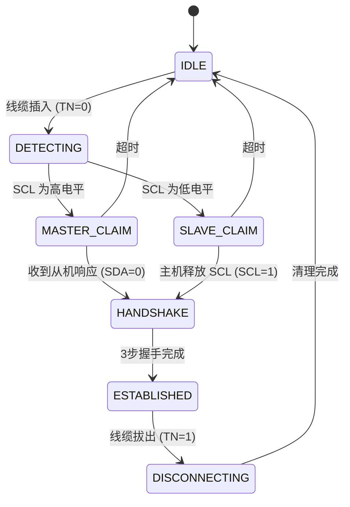
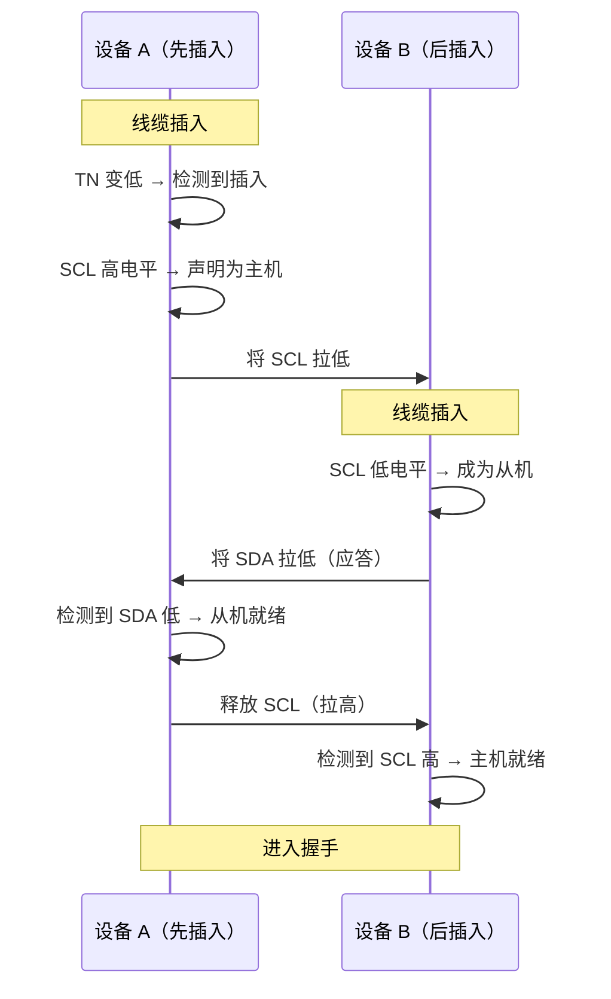
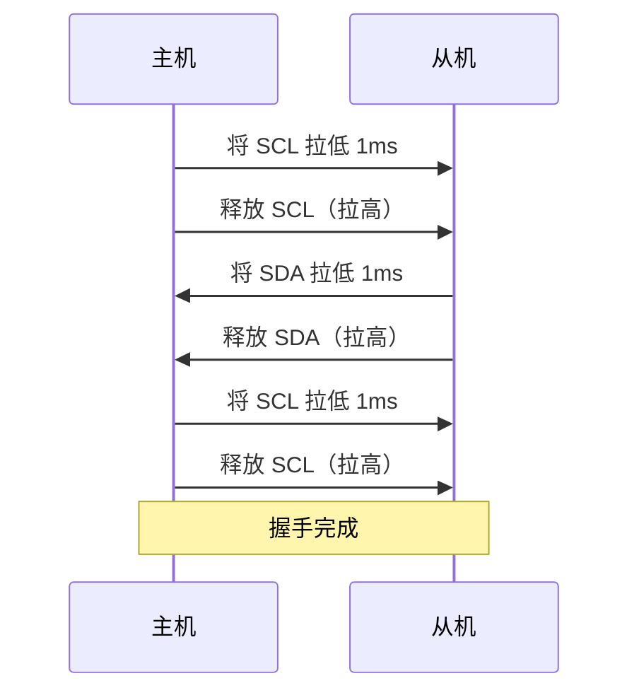
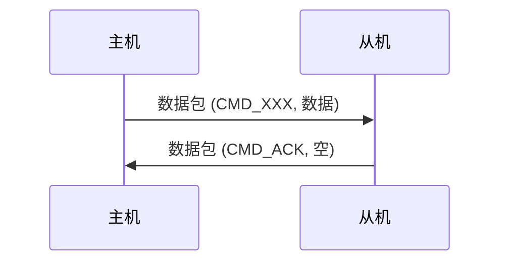
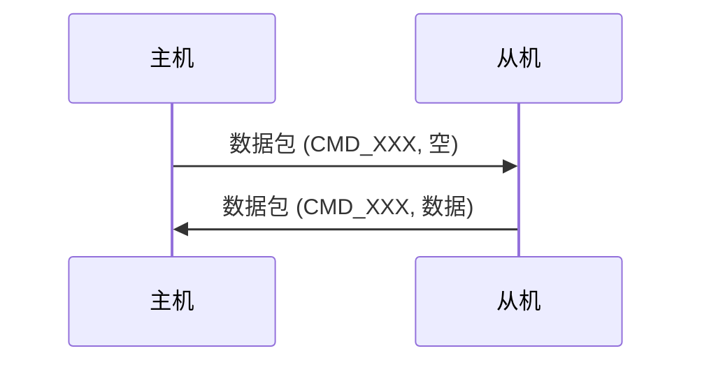
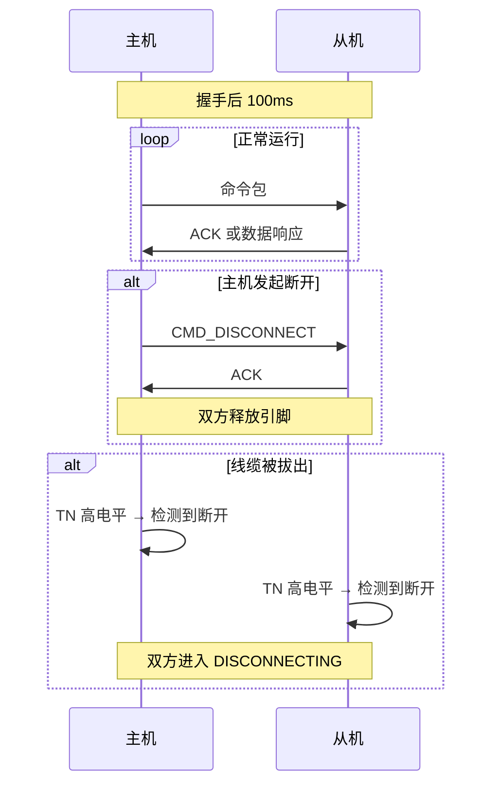

# I2C 通信协议文档 (i.MX RT1011)

---

## 1. 概述

本文档描述了两个 **i.MX RT1011** 设备之间通过 3.5mm 音频接口进行数据交换的通信协议与实现方案。系统支持动态主从协商、基于数据包的可靠传输以及异步文件传输。

### 1.1 主要特性

| 特性 | 说明 |
| :--- | :--- |
| 动态主从协商 | 先插入音频线的一方自动成为主机 |
| 物理连接检测 | 通过 GPIO_AD_07（TN 引脚）实时检测线缆插拔 |
| 可靠数据包协议 | 支持 CRC16 校验，确保数据完整性 |
| I2C 数据交换 | 100 kHz 标准速率 |
| 异步文件传输 | 支持进度跟踪，非阻塞设计 |
| 热插拔支持 | 实时检测连接断开并自动恢复 |

### 1.2 引脚定义表 (RT1011 80-pin LQFP)

| 引脚名 | 物理 Pin | GPIO 端口 | Pin 号 | 功能 | 上拉/下拉 |
| :--- | :--- | :--- | :--- | :--- | :--- |
| **GPIO_AD_09** | 48 | GPIO1 | 23 | I2C SDA | 4.7kΩ 上拉至 3.3V |
| **GPIO_AD_10** | 47 | GPIO1 | 24 | I2C SCL | 4.7kΩ 上拉至 3.3V |
| **GPIO_AD_07** | 51 | GPIO1 | 21 | TN (Tip Normal) | 100kΩ 下拉至 GND |
| **GPIO_AD_08** | 49 | GPIO1 | 22 | RN (Ring Normal) | 100kΩ 下拉至 GND |
| **GND** | 16, 30, 54, 78 | — | — | 公共地 | 直接连接 |

---

## 2. 硬件接口

### 2.1 引脚分配

两台 RT1011 使用完全相同的引脚分配，实现对称操作。

| 音频插座引脚 | RT1011 GPIO | 功能 | 上拉/下拉配置 |
| :--- | :--- | :--- | :--- |
| T (Tip) | GPIO_AD_09 (Pin 23) | I2C SDA | 4.7kΩ 上拉至 3.3V |
| R (Ring) | GPIO_AD_10 (Pin 24) | I2C SCL | 4.7kΩ 上拉至 3.3V |
| S (Sleeve) | GND | 公共地 | 直接连接 |
| RN (Ring Normal) | GPIO_AD_08 (Pin 22) | 线缆检测（SCL 侧） | 100kΩ 下拉至 GND |
| TN (Tip Normal) | GPIO_AD_07 (Pin 21) | 线缆检测（SDA 侧） | 100kΩ 下拉至 GND |

### 2.2 连接检测逻辑

| 状态 | TN/RN 电平 | 含义 |
| :--- | :--- | :--- |
| 未插入线缆 | 高电平（3.3V） | 无连接 |
| 已插入线缆 | 低电平（0V） | 连接已建立 |
| 线缆被拔出 | 高电平（3.3V） | 连接断开 |

### 2.3 电气特性

| 参数 | 数值 | 条件 |
| :--- | :--- | :--- |
| I2C 总线电压 | 3.3V | VDDIO |
| I2C 通信速率 | 100 kHz | 标准模式 |
| 上拉电阻 | 4.7 kΩ ± 5% | SDA 和 SCL 线 |
| 下拉电阻 | 100 kΩ ± 5% | RN 和 TN 线 |
| 推荐线缆长度 | ≤ 1 米 | — |
| 逻辑低电平 (VIL) | ≤ 0.8V | 3.3V 逻辑 |
| 逻辑高电平 (VIH) | ≥ 2.0V | 3.3V 逻辑 |

---

## 3. 通信协议

### 3.1 数据包结构

| 字段 | 偏移 | 大小 | 字节序 | 描述 |
| :--- | :--- | :--- | :--- | :--- |
| `长度` | 0 | 2 | 大端 | 数据字节数（0–480） |
| `命令码` | 2 | 1 | N/A | 操作代码 |
| `数据` | 3 | N | N/A | 应用层有效载荷（0–480 字节） |
| `校验和` | 3+N | 4 | 大端 | CRC16（扩展至 32 位，仅低 16 位有效） |

### 3.2 命令码

| 命令码 | 值 | 方向 | 描述 |
| :--- | :--- | :--- | :--- |
| `CMD_HANDSHAKE` | 0x01 | 双向 | 握手发起 |
| `CMD_ACK` | 0x02 | 双向 | 肯定应答 |
| `CMD_NACK` | 0x03 | 双向 | 否定应答 |
| `CMD_PING` | 0x04 | 主机 → 从机 | 心跳保活 |
| `CMD_STATUS` | 0x05 | 主机 → 从机 | 查询设备状态 |
| `CMD_RESET` | 0x06 | 主机 → 从机 | 复位远端设备 |
| `CMD_FILE_DATA` | 0x10 | 主机 → 从机 | 文件数据块 |
| `CMD_FILE_END` | 0x11 | 主机 → 从机 | 文件传输结束 |
| `CMD_FILE_REQ` | 0x12 | 主机 → 从机 | 请求文件 |
| `CMD_FILE_RESP` | 0x13 | 从机 → 主机 | 文件请求响应 |
| `CMD_FILE_INFO` | 0x14 | 主机 → 从机 | 文件元数据 |
| `CMD_FILE_START` | 0x15 | 主机 → 从机 | 开始文件传输 |
| `CMD_KEY_EVENT` | 0x20 | 双向 | 按键事件 |
| `CMD_KEY_SCAN` | 0x21 | 主机 → 从机 | 按键扫描请求 |
| `CMD_GPIO_SET` | 0x30 | 主机 → 从机 | 设置远端 GPIO 输出 |
| `CMD_GPIO_GET` | 0x31 | 主机 → 从机 | 读取远端 GPIO 输入 |
| `CMD_GPIO_CFG` | 0x32 | 主机 → 从机 | 配置远端 GPIO 方向 |
| `CMD_GET_TIME` | 0x40 | 主机 → 从机 | 获取远端时间戳 |
| `CMD_SET_TIME` | 0x41 | 主机 → 从机 | 设置远端时间戳 |
| `CMD_GET_INFO` | 0x42 | 主机 → 从机 | 获取设备信息 |
| `CMD_REBOOT` | 0x43 | 主机 → 从机 | 重启远端设备 |
| `CMD_DISCONNECT` | 0xFF | 双向 | 优雅断开连接 |

### 3.3 文件元数据结构

```cpp
struct __attribute__((packed)) FileMeta {
    uint32_t total_size;   // 文件总大小（字节）
    uint8_t  filename[32]; // 8.3 格式文件名
    uint8_t  reserved[3];  // 保留
};
```

---

## 4. 状态机

### 4.1 状态定义

| 状态 | 描述 |
| :--- | :--- |
| `IDLE` | 等待线缆插入 |
| `DETECTING` | 检测到线缆，正在确定角色 |
| `MASTER_CLAIM` | 正在声明主机角色 |
| `SLAVE_CLAIM` | 正在声明从机角色 |
| `HANDSHAKE` | 正在执行 3 步握手 |
| `ESTABLISHED` | I2C 链路已建立 |
| `DISCONNECTING` | 正在优雅断开连接 |

### 4.2 状态转换图


```mermaid
stateDiagram-v2
    [*] --> IDLE

    IDLE --> DETECTING: 线缆插入 (TN=0)

    DETECTING --> MASTER_CLAIM: SCL 为高电平
    DETECTING --> SLAVE_CLAIM: SCL 为低电平

    MASTER_CLAIM --> HANDSHAKE: 收到从机响应 (SDA=0)
    MASTER_CLAIM --> IDLE: 超时

    SLAVE_CLAIM --> HANDSHAKE: 主机释放 SCL (SCL=1)
    SLAVE_CLAIM --> IDLE: 超时

    HANDSHAKE --> ESTABLISHED: 3步握手完成

    ESTABLISHED --> DISCONNECTING: 线缆拔出 (TN=1)

    DISCONNECTING --> IDLE: 清理完成
```

### 4.3 角色协商流程


```mermaid
sequenceDiagram
    participant A as 设备 A（先插入）
    participant B as 设备 B（后插入）

    Note over A: 线缆插入
    A->>A: TN 变低 → 检测到插入
    A->>A: SCL 高电平 → 声明为主机
    A->>B: 将 SCL 拉低
    Note over B: 线缆插入
    B->>B: SCL 低电平 → 成为从机
    B->>A: 将 SDA 拉低（应答）
    A->>A: 检测到 SDA 低 → 从机就绪
    A->>B: 释放 SCL（拉高）
    B->>B: 检测到 SCL 高 → 主机就绪
    Note over A,B: 进入握手
```

### 4.4 握手流程


```mermaid
sequenceDiagram
    participant Master as 主机
    participant Slave as 从机

    Master->>Slave: 将 SCL 拉低 1ms
    Master->>Slave: 释放 SCL（拉高）
    Slave->>Master: 将 SDA 拉低 1ms
    Slave->>Master: 释放 SDA（拉高）
    Master->>Slave: 将 SCL 拉低 1ms
    Master->>Slave: 释放 SCL（拉高）
    Note over Master,Slave: 握手完成
```

---

## 5. 数据传输

### 5.1 数据包交换流程

**主机发送数据到从机：**


```mermaid
sequenceDiagram
    participant Master as 主机
    participant Slave as 从机

    Master->>Slave: 数据包 (CMD_XXX, 数据)
    Slave->>Master: 数据包 (CMD_ACK, 空)
```

**主机从从机请求数据：**


```mermaid
sequenceDiagram
    participant Master as 主机
    participant Slave as 从机

    Master->>Slave: 数据包 (CMD_XXX, 空)
    Slave->>Master: 数据包 (CMD_XXX, 数据)
```

### 5.2 文件传输协议

**发送端（主机）：**

| 步骤 | 数据包类型 | 数据内容 | 描述 |
| :--- | :--- | :--- | :--- |
| 1 | `CMD_FILE_START` | FileMeta | 文件元数据 |
| 2..N | `CMD_FILE_DATA` | 数据块 | 文件内容（≤480 字节/块） |
| N+1 | `CMD_FILE_END` | 空 | 文件结束标记 |

**接收端（从机）：**

| 步骤 | 操作 | 描述 |
| :--- | :--- | :--- |
| 1 | 接收 `CMD_FILE_START` | 提取元数据，准备文件 |
| 2 | 接收 `CMD_FILE_DATA` | 追加数据块，更新进度 |
| 3 | 接收 `CMD_FILE_END` | 完成文件写入 |

### 5.3 异步文件传输

文件传输采用**非阻塞**设计，避免阻塞主应用循环。

---

## 6. API 参考

### 6.1 I2CLink 类

```cpp
namespace commu {
class I2CLink {
public:
    I2CLink(I2C_Type *i2c = LPI2C1, uint8_t addr = 0x42);

    // 引脚初始化
    void init_pins(uint32_t sda = 23, uint32_t scl = 24,
                   uint32_t rn = 22, uint32_t tn = 21);

    // 连接检测
    bool is_cable_inserted() const;
    bool is_scl_high() const;
    bool is_sda_high() const;

    // 角色协商
    bool claim_master(uint32_t timeout_ms = 500);
    bool claim_slave(uint32_t timeout_ms = 500);
    bool handshake_master(uint32_t timeout_ms = 5000);
    bool handshake_slave(uint32_t timeout_ms = 5000);

    // 主从模式
    void enable_master(uint32_t baudrate = 100 * 1000);
    void enable_slave(i2c_slave_callback_t callback = nullptr,
                      void* user_data = nullptr);

    // I2C 操作
    bool master_write(const uint8_t* data, size_t len);
    bool master_read(uint8_t* buf, size_t len, uint32_t timeout_ms = 100);

    // Slave 缓冲
    void slave_set_tx_data(const uint8_t* data, size_t len);
    const std::vector<uint8_t>& slave_get_rx_data() const;
    void slave_clear_rx_data();

    // 断开连接
    void disconnect();

    // Getters
    bool is_slave_ready() const;
    bool is_master_ready() const;
};
}
```

### 6.2 文件传输

```cpp
namespace commu {
class FileTransfer {
public:
    FileTransfer(I2CLink &link, SDCard::FATFS *fatfs);

    // 异步发送/接收
    bool send_file(const char *filename, TransferCallback callback = nullptr);
    bool recv_file(const char *filename, TransferCallback callback = nullptr);

    void cancel();
    TransferStatus get_status() const;
    void process();  // 在主循环中调用
};
}
```

### 6.3 TransferStatus 结构体

```cpp
struct TransferStatus {
    TransferDirection direction;   // SEND、RECEIVE 或 IDLE
    uint32_t total_bytes;
    uint32_t bytes_transferred;
    uint32_t progress_percent;     // 0–100
    bool is_active;
    bool is_complete;
    bool has_error;
    bool cancel_requested;
    char filename[32];
};
```

---

## 7. 使用示例

### 7.1 基础通信设置

```cpp
#include "commu/commu_i2c_link.hpp"

commu::I2CLink link(LPI2C1, 0x42);

int main() {
    link.init_pins();

    while (true) {
        if (link.is_cable_inserted()) {
            if (link.is_scl_high()) {
                // 主机模式
                link.enable_master();
                if (link.claim_master() && link.handshake_master()) {
                    // 链路已建立
                }
            } else {
                // 从机模式
                link.enable_slave();
                if (link.claim_slave() && link.handshake_slave()) {
                    // 链路已建立
                }
            }
        }
    }
}
```

### 7.2 带进度显示的文件传输

```cpp
#include "commu/file_transfer.hpp"
#include "dispinterface/stddisplay.hpp"

extern Display::RedTFTdisp display;
extern GFXfont Arial_14;

commu::FileTransfer ft(link, &fatfs);

void update_display() {
    auto status = ft.get_status();

    display.ClearScreen(RGB565_BLACK);

    if (status.is_active) {
        // 文件名
        display.DrawTextF(0, 0, &Arial_14, 1,
                          "%l文件: %s%l", RGB565_CYAN, status.filename, RGB565_WHITE);

        // 进度百分比
        char buf[16];
        snprintf(buf, sizeof(buf), "%lu%%", status.progress_percent);
        display.DrawTextF(60, 25, &Arial_14, 2,
                          "%l%s%l", RGB565_GREEN, buf, RGB565_WHITE);

        // 进度条
        int fill = (status.progress_percent * 140) / 100;
        display.DrawRect(10, 50, 140, 10, RGB565_GRAY);
        if (fill > 0) {
            display.DrawRect(11, 51, fill - 2, 8, RGB565_GREEN);
        }

    } else if (status.is_complete) {
        display.DrawTextF(0, 30, &Arial_14, 2,
                          "%l传输完成！%l", RGB565_GREEN, RGB565_WHITE);
    } else if (status.has_error) {
        display.DrawTextF(0, 30, &Arial_14, 2,
                          "%l传输失败！%l", RGB565_RED, RGB565_WHITE);
    }
}

int main() {
    display.InitPin();
    display.InitDisplay();
    display.ClearScreen(RGB565_BLACK);

    ft.init();

    while (true) {
        ft.process();
        update_display();
        sleep_ms(20);
    }
}
```

### 7.3 发送按键事件

```cpp
// 主机发送按键码
if (link.is_master_ready()) {
    uint8_t key_code = 0x12;
    link.master_write(&key_code, 1);
}
```

---

## 8. 文件结构

```text
inc/
├── gpio_rt1011.hpp              // GPIO 抽象层
├── keypadio.hpp                 // 矩阵键盘驱动
└── commu/
    ├── commu_types.hpp          // 类型定义、命令码
    ├── commu_crc.hpp            // CRC16 实现
    ├── commu_packet.hpp         // 数据包构造/解析
    ├── commu_queue.hpp          // 无锁环形队列
    ├── commu_i2c_link.hpp       // I2C 物理层（含 Slave）
    └── file_transfer.hpp        // 异步文件传输
```

---

## 9. 错误处理

### 9.1 连接监控

- GPIO_AD_07（TN）持续被监控
- 所有操作在执行前检查连接状态
- 检测到断开时，状态机进入 `DISCONNECTING` 状态

### 9.2 超时处理

| 操作 | 超时时间 | 行为 |
| :--- | :--- | :--- |
| 角色协商 | 500 ms | 返回 IDLE |
| 握手 | 5 s | 返回 IDLE |
| 数据包接收 | 100 ms（可配置） | 返回失败 |

### 9.3 错误恢复

| 错误类型 | 恢复动作 |
| :--- | :--- |
| 校验和错误 | 丢弃数据包，等待重传 |
| I2C NAK | 重试（最多 3 次） |
| 连接断开 | 清除状态，返回 IDLE |
| SD 卡错误 | 标记传输错误 |

---

## 10. 通信过程与细节

### 10.1 线缆插入与角色协商


```mermaid
sequenceDiagram
    participant A as 设备 A（先插入）
    participant B as 设备 B（后插入）

    Note over A: 线缆插入
    A->>A: TN 变低 → 检测到插入
    A->>A: SCL 高电平 → 声明为主机
    A->>B: 将 SCL 拉低
    Note over B: 线缆插入
    B->>B: SCL 低电平 → 成为从机
    B->>A: 将 SDA 拉低（应答）
    A->>A: 检测到 SDA 低 → 从机就绪
    A->>B: 释放 SCL（拉高）
    B->>B: 检测到 SCL 高 → 主机就绪
    Note over A,B: 进入握手
```

### 10.2 握手（3步脉冲交换）


```mermaid
sequenceDiagram
    participant Master as 主机
    participant Slave as 从机

    Master->>Slave: 将 SCL 拉低 1ms
    Master->>Slave: 释放 SCL（拉高）
    Slave->>Master: 将 SDA 拉低 1ms
    Slave->>Master: 释放 SDA（拉高）
    Master->>Slave: 将 SCL 拉低 1ms
    Master->>Slave: 释放 SCL（拉高）
    Note over Master,Slave: 握手完成
```

### 10.3 I2C 通信与断开


```mermaid
sequenceDiagram
    participant Master as 主机
    participant Slave as 从机

    Note over Master,Slave: 握手后 100ms
    
    loop 正常运行
        Master->>Slave: 命令包
        Slave->>Master: ACK 或数据响应
    end
    
    alt 主机发起断开
        Master->>Slave: CMD_DISCONNECT
        Slave->>Master: ACK
        Note over Master,Slave: 双方释放引脚
    end
    
    alt 线缆被拔出
        Master->>Master: TN 高电平 → 检测到断开
        Slave->>Slave: TN 高电平 → 检测到断开
        Note over Master,Slave: 双方进入 DISCONNECTING
    end
```

### 10.4 详细过程

#### 10.4.1 数据线插入

1. A 机耳机孔插入耳机线，依次断开 `R-RN`、`T-TN`，使 `GPIO6`、`GPIO7` 依次降为低电平。当 `GPIO7` 为低电平时，认定为耳机线插入。此时 A 机检查 `GPIO5`（`R`）电平，为高电平（上拉电阻 `R5`），说明 A 机为主机。

2. A 机将 `GPIO5` 设为低电平，保持，同时监听 `GPIO4`（`T`）与 `GPIO7`（`TN`）电平（若 `GPIO7` 回到高电平，说明物理连接中断）。

3. B 机耳机孔插入耳机线，依次断开 `R-RN`、`T-TN`，使 `GPIO6`、`GPIO7` 依次降为低电平。当 `GPIO7` 为低电平时，认定为耳机线插入。此时 B 机检查 `GPIO5`（`R`）电平，为低电平，说明 B 机为从机。

4. B 机将 `GPIO4` 设为低电平，保持，同时监听 `GPIO5`（`R`）与 `GPIO7`（`TN`）电平（若 `GPIO7` 回到高电平，说明物理连接中断）。

5. A 机监测到 `GPIO4` 为低电平，认定为从机上线，将 `GPIO5` 设为高电平。

6. B 机监测到 `GPIO5` 为高电平，为主机响应，将 `GPIO4` 设为高电平。

至此，连接建立。

#### 10.4.2 握手

在握手过程中，时刻监视 `GPIO7` 引脚，若为高电平，说明物理连接断开，此时应断开连接。

1. A 机（主机）将 `GPIO5` 设为低电平 1ms，随后拉高。

2. B 机（从机）收到脉冲信号后，将 `GPIO4` 设为低电平 1ms，随后拉高。

3. A 机收到脉冲信号后，将 `GPIO5` 设为低电平 1ms，随后拉高。

4. 握手结束。

#### 10.4.3 I2C 通信

在通信时，也要时刻监视 `GPIO7` 引脚，若为高电平，说明物理连接断开，此时应断开连接。若正在操作 SD 卡，则撤销刚才完成的操作或中止并写入残缺文件信息，以免损坏文件系统。

1. 握手后 100ms，开启 I2C 通信。

2. 数据传输模仿 TCP 协议。

3. 主机无操作时，主机轮询，从机回应。主机有操作时，直接给从机发包。

#### 10.4.4 结束

1. 当有一方要断开连接时，给对方发结束包。对方收到结束包时，进入准备状态。当传输完毕时，主机发中断连接包给从机，双方结束 I2C 通信。

2. 100ms 后，A 机（主机）将 `GPIO5` 设为低电平，B 机（从机）将 `GPIO4` 设为低电平。

3. 当一方监测到 `GPIO7` 为高电平时，说明自己已断开连接，通信结束。

4. 当一方监测到对方线为高电平时，说明对方已断开连接，通知拔掉数据线。当 `GPIO7` 为高电平时，说明自己已断开连接，通信结束。

---

> 最近编辑: 8.28
