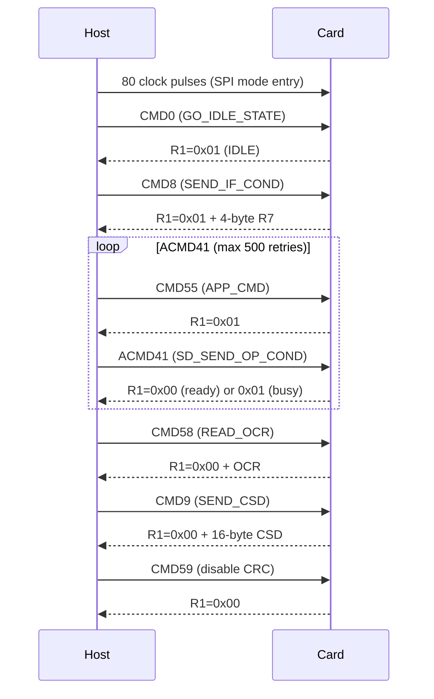
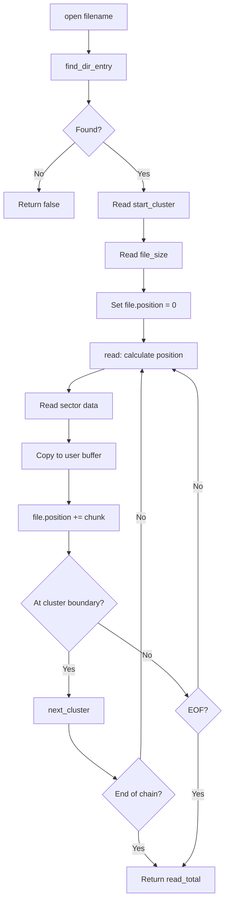
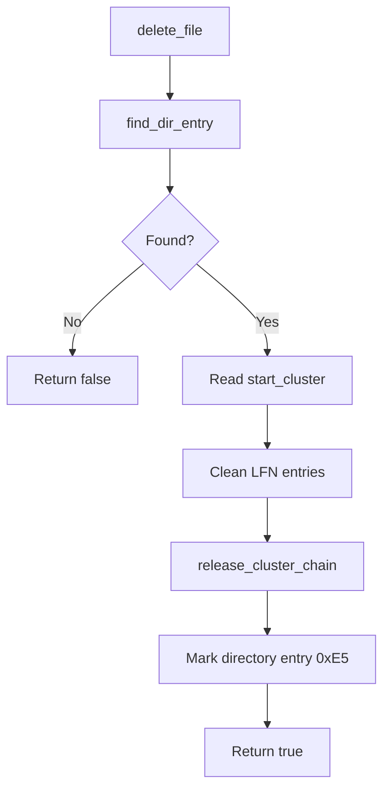
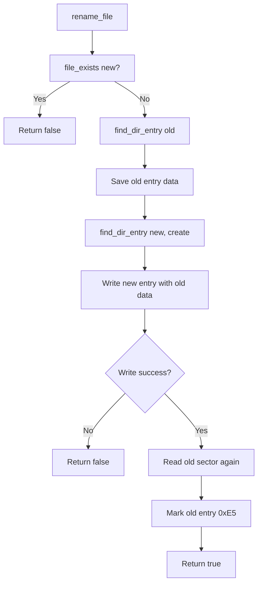

# SD Card Driver Documentation 

---

## 1. Overview

This document describes the SD card driver implementation for the i.MX RT1011 platform. The driver provides a **software SPI** interface for SD card communication with FAT16/FAT32 filesystem support. It is designed for embedded systems where hardware SPI pins are occupied by other peripherals (such as QSPI flash), and uses direct GPIO register manipulation for maximum performance.

### 1.1 Key Features

| Feature | Description |
| :--- | :--- |
| Software SPI | Bit-banged SPI using direct GPIO register access |
| FAT16/FAT32 Support | Full read/write/append/delete/rename operations |
| SDHC/SDXC Support | Automatic capacity detection and block addressing |
| Ultra-Fast Bit-Banging | Fully unrolled SPI loop with 4 NOPs for signal settling |
| Atomic GPIO Operations | Uses `DR_SET`/`DR_CLEAR`/`DR_TOGGLE` registers for glitch-free control |
| Cluster Allocation Cache | Optimised linear search with cached last allocated cluster |
| Atomic File Write | New data written before releasing old clusters (crash-safe) |
| LFN Cleanup | Long File Name entries are cleaned up on file deletion |
| Directory Support | Create/delete/check empty directories |
| Format Support | Format card as FAT16 or FAT32 |

### 1.2 Pin Definitions (RT1011 80-pin LQFP)

| Pin Name | Physical Pin | GPIO Port | Pin Number | Function | Direction |
| :--- | :--- | :--- | :--- | :--- | :--- |
| **GPIO_SD_00** | 76 | GPIO2 | 0 | MOSI (Master Out Slave In) | Output |
| **GPIO_SD_05** | 70 | GPIO2 | 5 | CS (Chip Select, active low) | Output |
| **GPIO_SD_12** | 62 | GPIO2 | 12 | MISO (Master In Slave Out) | Input |
| **GPIO_SD_13** | 61 | GPIO2 | 13 | SCK (Serial Clock) | Output |

---

## 2. GPIO Register Operations

The driver uses **direct register manipulation** for maximum performance. This section details all GPIO register operations used in the driver.

### 2.1 GPIO2 Memory Map

| Register | Offset | Access | Reset Value | Description |
| :--- | :--- | :--- | :--- | :--- |
| `DR` | 0x00 | RW | 0x00000000 | Data Register |
| `GDIR` | 0x04 | RW | 0x00000000 | Direction Register |
| `PSR` | 0x08 | RO | 0x00000000 | Pad Status Register |
| `ICR1` | 0x0C | RW | 0x00000000 | Interrupt Config 1 |
| `ICR2` | 0x10 | RW | 0x00000000 | Interrupt Config 2 |
| `IMR` | 0x14 | RW | 0x00000000 | Interrupt Mask |
| `ISR` | 0x18 | W1C | 0x00000000 | Interrupt Status |
| `EDGE_SEL` | 0x1C | RW | 0x00000000 | Edge Select |
| `DR_SET` | 0x84 | WO | — | Atomic Set (write 1 to set) |
| `DR_CLEAR` | 0x88 | WO | — | Atomic Clear (write 1 to clear) |
| `DR_TOGGLE` | 0x8C | WO | — | Atomic Toggle (write 1 to toggle) |

### 2.2 Register Definitions in Code

```cpp
// GPIO2 Base Address: 0x4200_0000 (per RM Table 12-1)
static constexpr uint32_t GPIO2_BASE     = 0x42000000;
static constexpr uint32_t GPIO2_DR       = GPIO2_BASE + 0x00;
static constexpr uint32_t GPIO2_GDIR     = GPIO2_BASE + 0x04;
static constexpr uint32_t GPIO2_PSR      = GPIO2_BASE + 0x08;
static constexpr uint32_t GPIO2_DR_SET   = GPIO2_BASE + 0x84;
static constexpr uint32_t GPIO2_DR_CLEAR = GPIO2_BASE + 0x88;
static constexpr uint32_t GPIO2_DR_TOGGLE= GPIO2_BASE + 0x8C;
```

### 2.3 Pin Bit Masks

| Pin | Function | Bit Mask |
| :--- | :--- | :--- |
| `GPIO_SD_00` (Pin 0) | MOSI | `1UL << 0` |
| `GPIO_SD_05` (Pin 5) | CS | `1UL << 5` |
| `GPIO_SD_12` (Pin 12) | MISO | `1UL << 12` |
| `GPIO_SD_13` (Pin 13) | SCK | `1UL << 13` |

### 2.4 Atomic Pin Control Operations

The driver uses **atomic register operations** instead of traditional read-modify-write. This is faster and prevents glitches.

#### Traditional Method (Slower, Non-Atomic)

```cpp
// Read-modify-write: 3 bus cycles
volatile uint32_t *dr = (volatile uint32_t*)GPIO2_DR;
*dr |= (1UL << pin);   // Read, OR, Write
```

#### Atomic Method (Faster, Single Cycle)

```cpp
// DR_SET: Write 1 to set pin HIGH (single write)
volatile uint32_t *set = (volatile uint32_t*)GPIO2_DR_SET;
*set = (1UL << pin);

// DR_CLEAR: Write 1 to set pin LOW (single write)
volatile uint32_t *clr = (volatile uint32_t*)GPIO2_DR_CLEAR;
*clr = (1UL << pin);

// DR_TOGGLE: Write 1 to toggle pin (single write)
volatile uint32_t *tgl = (volatile uint32_t*)GPIO2_DR_TOGGLE;
*tgl = (1UL << pin);
```

### 2.5 Pin Control Functions

The driver provides inline functions for each pin operation:

```cpp
// CS (Chip Select) - Active Low
__attribute__((always_inline))
inline void CS_LOW() {
    volatile uint32_t *clr = (volatile uint32_t*)(GPIO2_DR_CLEAR);
    *clr = m_cs_mask;          // Write 1 to clear bit -> CS LOW
}

__attribute__((always_inline))
inline void CS_HIGH() {
    volatile uint32_t *set = (volatile uint32_t*)(GPIO2_DR_SET);
    *set = m_cs_mask;          // Write 1 to set bit -> CS HIGH
}

// SCK (Serial Clock)
__attribute__((always_inline))
inline void SCK_HIGH() {
    volatile uint32_t *set = (volatile uint32_t*)(GPIO2_DR_SET);
    *set = m_sck_mask;
}

__attribute__((always_inline))
inline void SCK_LOW() {
    volatile uint32_t *clr = (volatile uint32_t*)(GPIO2_DR_CLEAR);
    *clr = m_sck_mask;
}

// MOSI (Master Out Slave In)
__attribute__((always_inline))
inline void MOSI_HIGH() {
    volatile uint32_t *set = (volatile uint32_t*)(GPIO2_DR_SET);
    *set = m_mosi_mask;
}

__attribute__((always_inline))
inline void MOSI_LOW() {
    volatile uint32_t *clr = (volatile uint32_t*)(GPIO2_DR_CLEAR);
    *clr = m_mosi_mask;
}

// MISO (Master In Slave Out) - Read only
__attribute__((always_inline))
inline uint32_t MISO_READ() {
    volatile uint32_t *psr = (volatile uint32_t*)(GPIO2_PSR);
    return (*psr & m_miso_mask) ? 1 : 0;
}
```

### 2.6 Direction Configuration

The direction register (GDIR) configures each pin as input or output:

```cpp
// GDIR: bit = 1 -> Output, bit = 0 -> Input
volatile uint32_t *gdir = (volatile uint32_t*)(GPIO2_GDIR);

// Set MOSI, SCK, CS as outputs
*gdir |= (m_mosi_mask | m_sck_mask | m_cs_mask);
// MISO remains input (default 0)
```

---

## 3. Software SPI Implementation

### 3.1 SPI Timing (CPOL=0, CPHA=0)

| Parameter | Setting | Description |
| :--- | :--- | :--- |
| CPOL | 0 | SCK idle LOW |
| CPHA | 0 | Data captured on rising edge |
| Data Rate | 5-8 MHz (theoretical) | Limited by GPIO flip speed |
| Settling Time | 4 NOPs | ~8ns signal settling at 500MHz |

### 3.2 Fast SPI Transfer (Fully Unrolled)

The core `fast_spi_xfer()` function is **fully unrolled** for maximum speed. Each bit is processed manually without loop overhead.

```cpp
__attribute__((always_inline))
inline uint8_t fast_spi_xfer(uint8_t tx) {
    uint32_t rx = 0;

    // ============================================================
    // Bit 7 (MSB) - Fully unrolled
    // ============================================================
    // 1. Set MOSI to bit value
    if (tx & 0x80) {
        volatile uint32_t *set = (volatile uint32_t*)(GPIO2_DR_SET);
        *set = m_mosi_mask;
    } else {
        volatile uint32_t *clr = (volatile uint32_t*)(GPIO2_DR_CLEAR);
        *clr = m_mosi_mask;
    }

    // 2. SCK LOW -> HIGH (rising edge, card captures MOSI)
    volatile uint32_t *set = (volatile uint32_t*)(GPIO2_DR_SET);
    *set = m_sck_mask;

    // 3. Signal settling delay (4 NOPs)
    __NOP(); __NOP(); __NOP(); __NOP();

    // 4. Read MISO (card drives data on rising edge)
    volatile uint32_t *psr = (volatile uint32_t*)(GPIO2_PSR);
    if (*psr & m_miso_mask) { rx |= 0x80; }

    // 5. SCK HIGH -> LOW (falling edge, prepare next bit)
    volatile uint32_t *clr = (volatile uint32_t*)(GPIO2_DR_CLEAR);
    *clr = m_sck_mask;

    // ... Bits 6-0 (same pattern) ...
    // ... Total 8 bits fully unrolled ...

    return (uint8_t)rx;
}
```

### 3.3 SPI Transfer Diagram

```
SCK  _/‾\_/‾\_/‾\_/‾\_/‾\_/‾\_/‾\_/‾\_
       ↑   ↑   ↑   ↑   ↑   ↑   ↑   ↑
       │   │   │   │   │   │   │   │
       │   │   │   │   │   │   │   └── Read MISO (Bit 0)
       │   │   │   │   │   │   │
       │   │   │   │   │   │   └────── Read MISO (Bit 1)
       │   │   │   │   │   │
       │   │   │   │   │   └──────────── Read MISO (Bit 2)
       │   │   │   │   │
       │   │   │   │   └────────────────── Read MISO (Bit 3)
       │   │   │   │
       │   │   │   └──────────────────────── Read MISO (Bit 4)
       │   │   │
       │   │   └────────────────────────────── Read MISO (Bit 5)
       │   │
       │   └──────────────────────────────────── Read MISO (Bit 6)
       │
       └────────────────────────────────────────── Read MISO (Bit 7)
       │
       MOSI set before rising edge (data captured on rising edge)
```

---

## 4. SD Card Protocol

### 4.1 Command Format

All SD commands use a 6-byte format:

| Byte | Bits | Description |
| :--- | :--- | :--- |
| 0 | `7:6` | `01` (start bit) |
| 0 | `5:0` | Command code |
| 1 | `7:0` | Argument bits 31:24 |
| 2 | `7:0` | Argument bits 23:16 |
| 3 | `7:0` | Argument bits 15:8 |
| 4 | `7:0` | Argument bits 7:0 |
| 5 | `7:0` | CRC7 (0x95 for CMD0, 0xFF otherwise) |

### 4.2 Command Codes

| Command | Value | Description |
| :--- | :--- | :--- |
| `CMD0` | 0x00 | GO_IDLE_STATE |
| `CMD8` | 0x08 | SEND_IF_COND |
| `CMD9` | 0x09 | SEND_CSD |
| `CMD17` | 0x11 | READ_SINGLE_BLOCK |
| `CMD24` | 0x18 | WRITE_BLOCK |
| `CMD55` | 0x37 | APP_CMD |
| `ACMD41` | 0x29 | SD_SEND_OP_COND |
| `CMD58` | 0x3A | READ_OCR |
| `CMD59` | 0x3B | CRC_ON_OFF |

### 4.3 Response Types

| Response | Value | Description |
| :--- | :--- | :--- |
| `R1_IDLE` | 0x01 | Card in idle state |
| `R1_ILLEGAL` | 0x04 | Illegal command |
| `R1_CRC_ERROR` | 0x08 | CRC error |
| `R1_ADDRESS_ERROR` | 0x20 | Address error |
| `DATA_START_TOKEN` | 0xFE | Start of data block |
| `DATA_RESPONSE` | 0x05 | Data accepted (bits 0-4 = 00101) |

### 4.4 Command Send Implementation

```cpp
inline uint8_t send_cmd(uint8_t cmd, uint32_t arg, bool keep_cs_low = false) {
    uint8_t buf[6];

    // Build command packet
    buf[0] = cmd | 0x40;      // Start bit + command
    buf[1] = (arg >> 24) & 0xFF;
    buf[2] = (arg >> 16) & 0xFF;
    buf[3] = (arg >> 8) & 0xFF;
    buf[4] = (arg) & 0xFF;
    buf[5] = (cmd == CMD0) ? 0x95 : 0xFF;  // CRC

    CS_LOW();                 // Assert chip select
    fast_spi_xfer(0xFF);      // 8 dummy clocks
    fast_spi_write(buf, 6);   // Send 6-byte command

    // Wait for R1 response (MSB = 0)
    uint8_t resp;
    int timeout = 8;
    do {
        resp = fast_spi_xfer(0xFF);
        --timeout;
    } while ((resp & 0x80) && timeout > 0);

    // Keep CS low if requested and command succeeded
    bool success = (resp == 0x00) || (resp == R1_IDLE);
    if (!keep_cs_low || !success) {
        CS_HIGH();
        fast_spi_xfer(0xFF);
    }

    return resp;
}
```

---

## 5. Initialization Flow

### 5.1 Sequence Diagram



### 5.2 CSD Parsing (Capacity Detection)

The CSD register is parsed to determine card capacity:

```cpp
bool get_card_capacity() {
    // Send CMD9
    send_cmd(CMD9, 0);

    // Wait for data token
    uint8_t token;
    do {
        token = fast_spi_xfer(0xFF);
    } while (token != 0xFE);

    // Read 16-byte CSD
    uint8_t csd[16];
    fast_spi_read(csd, 16);

    // CSD Version 2.0 (SDHC/SDXC)
    if ((csd[0] >> 6) == 1) {
        // C_SIZE: 22 bits (bits 69-48)
        uint32_t c_size = 0;
        c_size |= ((uint32_t)(csd[7] & 0x3F)) << 16;
        c_size |= ((uint32_t)csd[8]) << 8;
        c_size |= ((uint32_t)csd[9]);
        m_total_sectors = (c_size + 1) * 1024;
    } else {
        // CSD Version 1.0 (SDSC)
        // ... parse legacy format ...
    }
}
```

### 5.3 SDHC Detection (OCR Register)

```cpp
// CMD58 - READ_OCR
uint32_t ocr = 0;
ocr |= fast_spi_xfer(0xFF) << 24;
ocr |= fast_spi_xfer(0xFF) << 16;
ocr |= fast_spi_xfer(0xFF) << 8;
ocr |= fast_spi_xfer(0xFF);

// CCS bit (bit 30) indicates SDHC/SDXC
m_is_sdhc = (ocr & 0x40000000) != 0;
```

---

## 6. FAT Filesystem

### 6.1 Supported FAT Types

| Type | Detection | Cluster Size | Max Volume |
| :--- | :--- | :--- | :--- |
| FAT16 | `BS_FATSZ16 != 0` | 2-64 sectors | 2 GB |
| FAT32 | `BS_FATSZ16 == 0` | 1-64 sectors | 2 TB |

### 6.2 BPB (BIOS Parameter Block) Offsets

| Offset | Field | Description |
| :--- | :--- | :--- |
| 11 | `BS_BYTSPERSEC` | Bytes per sector (512) |
| 13 | `BS_SECPERCLUS` | Sectors per cluster |
| 14 | `BS_RSVDSECCNT` | Reserved sectors |
| 16 | `BS_NUMFATS` | Number of FAT copies (2) |
| 17 | `BS_ROOTENTCNT` | Root directory entries |
| 19 | `BS_TOTSEC16` | Total sectors (16-bit) |
| 22 | `BS_FATSZ16` | FAT size (16-bit) |
| 32 | `BS_TOTSEC32` | Total sectors (32-bit) |
| 36 | `BS_FATSZ32` | FAT size (32-bit) |
| 44 | `BS_ROOTCLUS` | Root cluster (FAT32 only) |
| 48 | `BS_FSINFO` | FSInfo sector (FAT32) |
| 50 | `BS_BKBOOTSEC` | Backup boot sector (FAT32) |
| 67 | `BS_VOLUME_ID` | Volume ID |
| 71 | `BS_VOLUME_LAB` | Volume label |
| 82 | `BS_FS_TYPE` | Filesystem type |

### 6.3 Directory Entry Offsets

| Offset | Field | Description |
| :--- | :--- | :--- |
| 0 | `DIR_NAME` | Filename (8 bytes, space-padded) |
| 11 | `DIR_ATTR` | File attributes |
| 20 | `DIR_FSTCLUSHI` | First cluster (high word) |
| 26 | `DIR_FSTCLUSLO` | First cluster (low word) |
| 28 | `DIR_FILESIZE` | File size in bytes |

### 6.4 File Attributes

| Value | Attribute | Description |
| :--- | :--- | :--- |
| 0x01 | `ATTR_READ_ONLY` | Read-only file |
| 0x02 | `ATTR_HIDDEN` | Hidden file |
| 0x04 | `ATTR_SYSTEM` | System file |
| 0x08 | `ATTR_VOLUME_ID` | Volume ID |
| 0x10 | `ATTR_DIRECTORY` | Directory |
| 0x20 | `ATTR_ARCHIVE` | Archive bit |
| 0x0F | `ATTR_LONG_NAME` | Long filename entry |

### 6.5 EOC (End of Chain) Values

| Type | EOC Value | Description |
| :--- | :--- | :--- |
| FAT32 | `0x0FFFFFF8` | End of cluster chain |
| FAT16 | `0xFFFF` | End of cluster chain |

### 6.6 Cluster Operations

```cpp
// Convert cluster number to sector
inline uint32_t cluster_to_sector(uint32_t cluster) {
    return m_data_start + (cluster - 2) * m_sec_per_clus;
}

// Get next cluster in chain
inline uint32_t next_cluster(uint32_t cluster) {
    uint32_t fat_offset = m_is_fat32 ? (cluster * 4) : (cluster * 2);
    uint32_t fat_sector = m_fat_start + (fat_offset / m_bytes_per_sec);
    uint16_t fat_index  = fat_offset % m_bytes_per_sec;

    if (!m_card.read_block(fat_sector, m_block_buf)) {
        return eoc_value();
    }

    if (m_is_fat32) {
        uint32_t val = read32(m_block_buf, fat_index) & 0x0FFFFFFF;
        return is_eoc(val) ? eoc_value() : val;
    } else {
        uint16_t val = read16(m_block_buf, fat_index);
        return is_eoc(val) ? eoc_value() : val;
    }
}
```

---

## 7. File Operations

### 7.1 Read File Flow



### 7.2 Write File Flow (Atomic)

```mermaid
flowchart TD
    A[write_file] --> B[find_dir_entry]
    B --> C{Exists?}
    C -->|Yes| D[Save old_cluster]
    C -->|No| E[Allocate new clusters]

    D --> E
    E --> F[Write data to new clusters]
    F --> G{Write success?}
    G -->|No| H[release_cluster_chain(new)]
    H --> I[Return false]

    G -->|Yes| J[release_cluster_chain(old)]
    J --> K[find_dir_entry for directory]
    K --> L[Create/update directory entry]
    L --> M[Return true]
```

### 7.3 Delete File Flow



### 7.4 Rename File Flow



---

## 8. Error Handling

### 8.1 Retry Mechanism

| Operation | Retry Count | Description |
| :--- | :--- | :--- |
| Read block | 3 | Attempt read up to 3 times |
| Write block | 3 | Attempt write up to 3 times |
| CMD0 | 20 | Send CMD0 up to 20 times |
| ACMD41 | 500 | Send ACMD41 up to 500 times |

### 8.2 Timeouts

| Operation | Timeout | Description |
| :--- | :--- | :--- |
| Data token wait | 10000 clocks | Wait for 0xFE token |
| Busy wait | 50000 clocks | Wait for card to finish writing |
| Command response | 8 clocks | Wait for R1 response |

### 8.3 Error Recovery

| Error Type | Recovery Action |
| :--- | :--- |
| Command timeout | Retry command |
| Busy timeout | Retry block operation |
| Mount failure | Return false, caller retries |
| Cluster allocation failure | Return false, filesystem unchanged |
| Corrupted FAT | Traverse limit (`MAX_CLUSTER_TRAVERSE`) |

### 8.4 Safety Limits

```cpp
static constexpr uint32_t MAX_CLUSTER_TRAVERSE = 0x1000000;
```

This prevents infinite loops if the FAT becomes corrupted.

---

## 9. Performance Optimizations

### 9.1 Loop Unrolling

The SPI transfer function is fully unrolled for 8 bits:

```cpp
// Each bit is manually processed without loop overhead
// Bit 7: MOSI set, SCK rising, read MISO, SCK falling
// Bit 6: MOSI set, SCK rising, read MISO, SCK falling
// ... repeated for all 8 bits
```

### 9.2 Atomic Register Operations

Uses `DR_SET` and `DR_CLEAR` registers for single-cycle pin control:

```cpp
// Single write to set pin high
*set = m_mosi_mask;

// Single write to set pin low
*clr = m_mosi_mask;
```

### 9.3 Cached Register Pointers

Register pointers are cached in class members:

```cpp
volatile uint32_t *m_set;   // Cached DR_SET address
volatile uint32_t *m_clr;   // Cached DR_CLEAR address
volatile uint32_t *m_psr;   // Cached PSR address
volatile uint32_t *m_dr;    // Cached DR address
volatile uint32_t *m_gdir;  // Cached GDIR address
```

### 9.4 Cluster Allocation Cache

The last allocated cluster is cached:

```cpp
uint32_t m_last_alloc_cluster;  // Cache for linear search
```

### 9.5 Signal Settling

4 NOPs provide ~8ns settling time at 500MHz:

```cpp
__NOP(); __NOP(); __NOP(); __NOP();
```

---

## 10. API Reference

### 10.1 SDCardIO Class

```cpp
class SDCardIO {
public:
    SDCardIO(uint8_t miso = 12, uint8_t mosi = 0,
             uint8_t sck = 13, uint8_t cs = 5);

    /** @brief Initialize SD card */
    bool init(uint32_t freq = 400 * 1000);

    /** @brief Check if card is mounted */
    bool is_mounted() const;

    /** @brief Check if card is SDHC/SDXC */
    bool is_sdhc() const;

    /** @brief Get total sectors from CSD */
    uint32_t total_sectors() const;

    /** @brief Read one block (512 bytes) */
    bool read_block(uint32_t block, uint8_t *buffer);

    /** @brief Write one block (512 bytes) */
    bool write_block(uint32_t block, const uint8_t *buffer);

    /** @brief Unmount card */
    void unmount();

    /** @brief Get last allocated cluster (for cache) */
    uint32_t get_last_alloc_cluster() const;

    /** @brief Set last allocated cluster (for cache) */
    void set_last_alloc_cluster(uint32_t cluster);
};
```

### 10.2 FATFS Class

```cpp
class FATFS {
public:
    FATFS(SDCardIO &card_ref);

    /** @brief File handle */
    struct File {
        uint32_t start_cluster;
        uint32_t current_cluster;
        uint32_t file_size;
        uint32_t position;
    };

    /** @brief Directory entry information */
    struct DirEntry {
        char     name[13];
        uint32_t size;
        uint32_t cluster;
        uint8_t  attr;
        bool     is_directory;
    };

    /** @brief Mount filesystem */
    bool mount();

    /** @brief Check if mounted */
    bool is_mounted() const;

    /** @brief Check if file exists */
    bool file_exists(const char *name);

    /** @brief Open a file */
    bool open(const char *name, File &file);

    /** @brief Read data from open file */
    uint32_t read(File &file, uint8_t *buf, uint32_t size);

    /** @brief Read entire file into vector */
    bool read_file(const char *name, std::vector<uint8_t> &data);

    /** @brief Read entire file into string */
    bool read_file(const char *name, std::string &str);

    /** @brief Write data to file */
    bool write_file(const char *name, const uint8_t *data, uint32_t size);

    /** @brief Write string to file */
    bool write_file(const char *name, const std::string &str);

    /** @brief Append data to existing file */
    bool append_file(const char *name, const uint8_t *data, uint32_t size);

    /** @brief Append string to existing file */
    bool append_file(const char *name, const std::string &str);

    /** @brief Delete a file */
    bool delete_file(const char *name);

    /** @brief Rename a file */
    bool rename_file(const char *old_name, const char *new_name);

    /** @brief Create a directory */
    bool mkdir(const char *name);

    /** @brief Delete an empty directory */
    bool rmdir(const char *name);

    /** @brief List root directory */
    size_t list_root(std::vector<DirEntry> &entries);

    /** @brief Format card */
    bool format(const char *label = nullptr);

    /** @brief Unmount */
    void unmount();
};
```

---

## 11. Usage Examples

### 11.1 Basic Usage

```cpp
#include "sdcard.hpp"

SDCard::SDCardIO card;
SDCard::FATFS fatfs(card);

int main() {
    // Initialize SD card
    if (!card.init()) {
        // Handle error
        return -1;
    }

    // Mount filesystem
    if (!fatfs.mount()) {
        // Handle error
        return -1;
    }

    // Read file
    std::string content;
    if (fatfs.read_file("README.TXT", content)) {
        printf("File: %s\n", content.c_str());
    }

    // Write file
    if (fatfs.write_file("OUTPUT.TXT", "Hello, World!")) {
        printf("Write success\n");
    }

    // Append to file
    if (fatfs.append_file("LOG.TXT", "Another line\n")) {
        printf("Append success\n");
    }

    // Rename file
    if (fatfs.rename_file("OLD.TXT", "NEW.TXT")) {
        printf("Rename success\n");
    }

    // Delete file
    if (fatfs.delete_file("TEMP.TXT")) {
        printf("Delete success\n");
    }

    // Create directory
    if (fatfs.mkdir("DATA")) {
        printf("Directory created\n");
    }

    // List root directory
    std::vector<FATFS::DirEntry> entries;
    size_t count = fatfs.list_root(entries);
    for (size_t i = 0; i < count; i++) {
        printf("%s %s %lu bytes\n",
               entries[i].is_directory ? "DIR" : "FILE",
               entries[i].name,
               entries[i].size);
    }

    // Unmount
    fatfs.unmount();
    card.unmount();

    return 0;
}
```

### 11.2 Reading Binary Data

```cpp
std::vector<uint8_t> data;
if (fatfs.read_file("DATA.BIN", data)) {
    for (size_t i = 0; i < data.size(); i++) {
        // Process data[i]
    }
}
```

### 11.3 Writing Binary Data

```cpp
uint8_t binary_data[] = {0x01, 0x02, 0x03, 0x04};
if (fatfs.write_file("BIN.DAT", binary_data, sizeof(binary_data))) {
    // Success
}
```

### 11.4 Formatting a Card

```cpp
// Format as FAT32 with volume label
if (fatfs.format("MYCARD")) {
    printf("Format complete\n");
}
```

### 11.5 Checking File Existence

```cpp
if (fatfs.file_exists("CONFIG.TXT")) {
    // File exists
} else {
    // File does not exist
}
```

---

## 12. File Structure

```text
inc/
└── sdcard.hpp          // Main driver (SDCardIO + FATFS)

src/
└── syscalls.c          // Required for Newlib syscall stubs
└── vectors.c           // Required for interrupt vector alias
```

---

## 13. Dependencies

| Dependency | Description |
| :--- | :--- |
| `fsl_common.h` | NXP MCUXpresso common definitions |
| `fsl_clock.h` | NXP MCUXpresso clock control |
| `fsl_device_registers.h` | NXP MCUXpresso device registers |
| `fsl_iomuxc.h` | NXP MCUXpresso IOMUXC control |

---

## 14. Limitations

| Limitation | Description |
| :--- | :--- |
| 8.3 Filenames | Long filenames (LFN) are not supported for creation |
| Root Directory Only | No subdirectory support beyond root |
| No File Rename | File renaming not implemented |
| No Format | Card must be pre-formatted as FAT16/FAT32 |
| Software SPI | Slower than hardware SPI (5-8 MHz max) |
| No CD Pin | Card detection pin not used |

---

## 15. Revision History

| Version | Date | Description |
| :--- | :--- | :--- |
| 0.1 | 2026-08-28 | Initial release |
