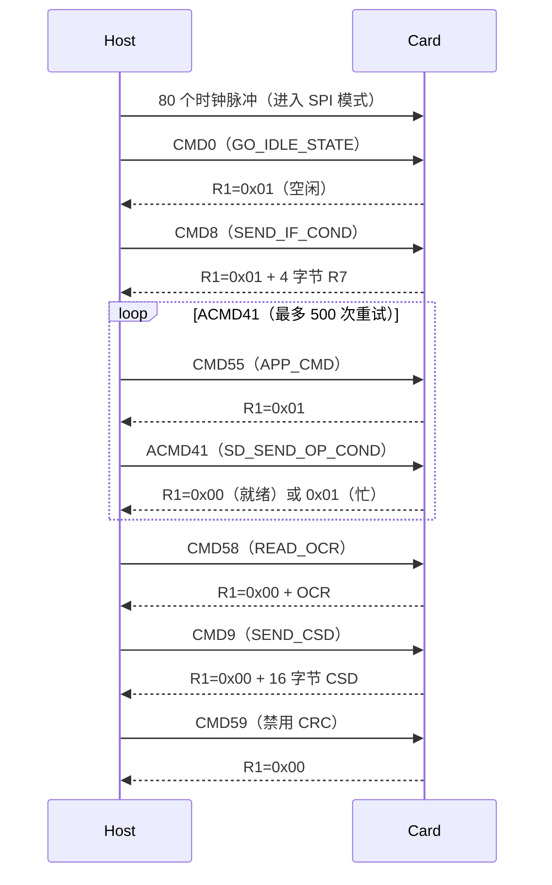
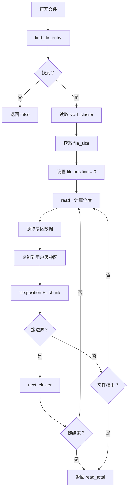
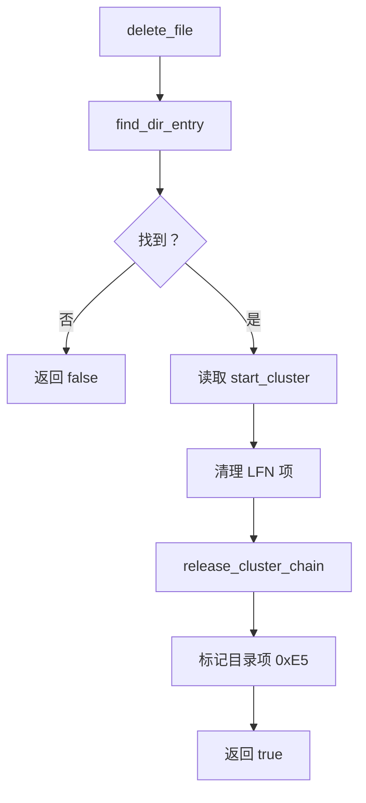
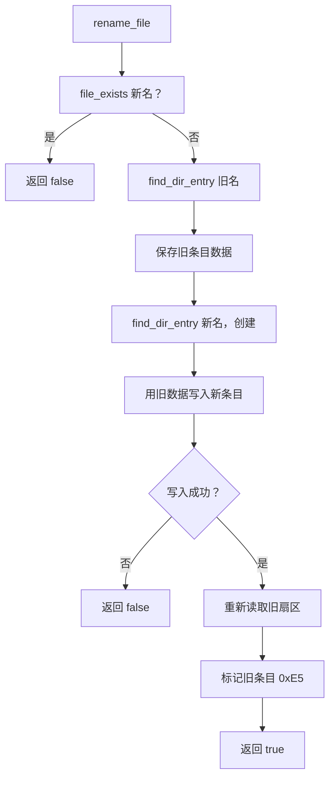

# SD 卡驱动文档

---

## 1. 概述

本文档描述 i.MX RT1011 平台的 SD 卡驱动实现。驱动使用**软件 SPI** 接口与 SD 卡通信，提供 FAT16/FAT32 文件系统支持。适用于硬件 SPI 引脚被其他外设占用（如 QSPI Flash）的嵌入式系统，通过直接操作 GPIO 寄存器获得最高性能。

### 1.1 主要特性

| 特性 | 说明 |
| :--- | :--- |
| 软件 SPI | 直接操作 GPIO 寄存器实现位翻转 SPI |
| FAT16/FAT32 支持 | 完整的读/写/追加/删除/重命名操作 |
| SDHC/SDXC 支持 | 自动检测容量类型，使用块寻址 |
| 超高速位翻转 | 完全展开的 SPI 循环，4 个 NOP 信号稳定 |
| 原子 GPIO 操作 | 使用 `DR_SET`/`DR_CLEAR`/`DR_TOGGLE` 寄存器无毛刺控制 |
| 簇分配缓存 | 线性搜索缓存上次分配的簇号 |
| 原子文件写入 | 先写新数据再释放旧簇（掉电安全） |
| LFN 清理 | 删除文件时自动清理长文件名条目 |
| 目录支持 | 创建/删除/检查空目录 |
| 格式化支持 | 格式化为 FAT16 或 FAT32 |

### 1.2 引脚定义 (RT1011 80-pin LQFP)

| 引脚名 | 物理引脚 | GPIO 端口 | Pin 号 | 功能 | 方向 |
| :--- | :--- | :--- | :--- | :--- | :--- |
| **GPIO_SD_00** | 76 | GPIO2 | 0 | MOSI（主出从入） | 输出 |
| **GPIO_SD_05** | 70 | GPIO2 | 5 | CS（片选，低有效） | 输出 |
| **GPIO_SD_12** | 62 | GPIO2 | 12 | MISO（主入从出） | 输入 |
| **GPIO_SD_13** | 61 | GPIO2 | 13 | SCK（串行时钟） | 输出 |

---

## 2. GPIO 寄存器操作

驱动使用**直接寄存器操作**获得最高性能。本节详细说明驱动中使用的所有 GPIO 寄存器操作。

### 2.1 GPIO2 内存映射

| 寄存器 | 偏移 | 访问 | 复位值 | 说明 |
| :--- | :--- | :--- | :--- | :--- |
| `DR` | 0x00 | RW | 0x00000000 | 数据寄存器 |
| `GDIR` | 0x04 | RW | 0x00000000 | 方向寄存器 |
| `PSR` | 0x08 | RO | 0x00000000 | 焊盘状态寄存器 |
| `ICR1` | 0x0C | RW | 0x00000000 | 中断配置 1 |
| `ICR2` | 0x10 | RW | 0x00000000 | 中断配置 2 |
| `IMR` | 0x14 | RW | 0x00000000 | 中断屏蔽 |
| `ISR` | 0x18 | W1C | 0x00000000 | 中断状态 |
| `EDGE_SEL` | 0x1C | RW | 0x00000000 | 边沿选择 |
| `DR_SET` | 0x84 | WO | — | 原子置位（写 1 置位） |
| `DR_CLEAR` | 0x88 | WO | — | 原子清除（写 1 清零） |
| `DR_TOGGLE` | 0x8C | WO | — | 原子翻转（写 1 翻转） |

### 2.2 代码中的寄存器定义

```cpp
// GPIO2 基地址: 0x4200_0000（参考手册表 12-1）
static constexpr uint32_t GPIO2_BASE     = 0x42000000;
static constexpr uint32_t GPIO2_DR       = GPIO2_BASE + 0x00;
static constexpr uint32_t GPIO2_GDIR     = GPIO2_BASE + 0x04;
static constexpr uint32_t GPIO2_PSR      = GPIO2_BASE + 0x08;
static constexpr uint32_t GPIO2_DR_SET   = GPIO2_BASE + 0x84;
static constexpr uint32_t GPIO2_DR_CLEAR = GPIO2_BASE + 0x88;
static constexpr uint32_t GPIO2_DR_TOGGLE= GPIO2_BASE + 0x8C;
```

### 2.3 引脚位掩码

| 引脚 | 功能 | 位掩码 |
| :--- | :--- | :--- |
| `GPIO_SD_00`（引脚 0） | MOSI | `1UL << 0` |
| `GPIO_SD_05`（引脚 5） | CS | `1UL << 5` |
| `GPIO_SD_12`（引脚 12） | MISO | `1UL << 12` |
| `GPIO_SD_13`（引脚 13） | SCK | `1UL << 13` |

### 2.4 原子引脚控制操作

驱动使用**原子寄存器操作**替代传统的读-改-写。更快且无毛刺。

#### 传统方法（慢、非原子）

```cpp
// 读-改-写：3 个总线周期
volatile uint32_t *dr = (volatile uint32_t*)GPIO2_DR;
*dr |= (1UL << pin);   // 读、或、写
```

#### 原子方法（快、单周期）

```cpp
// DR_SET：写 1 置位（单次写入）
volatile uint32_t *set = (volatile uint32_t*)GPIO2_DR_SET;
*set = (1UL << pin);

// DR_CLEAR：写 1 清零（单次写入）
volatile uint32_t *clr = (volatile uint32_t*)GPIO2_DR_CLEAR;
*clr = (1UL << pin);

// DR_TOGGLE：写 1 翻转（单次写入）
volatile uint32_t *tgl = (volatile uint32_t*)GPIO2_DR_TOGGLE;
*tgl = (1UL << pin);
```

### 2.5 引脚控制函数

驱动为每个引脚操作提供内联函数：

```cpp
// CS（片选）- 低有效
__attribute__((always_inline))
inline void CS_LOW() {
    volatile uint32_t *clr = (volatile uint32_t*)(GPIO2_DR_CLEAR);
    *clr = m_cs_mask;          // 写 1 清零 -> CS 低
}

__attribute__((always_inline))
inline void CS_HIGH() {
    volatile uint32_t *set = (volatile uint32_t*)(GPIO2_DR_SET);
    *set = m_cs_mask;          // 写 1 置位 -> CS 高
}

// SCK（串行时钟）
__attribute__((always_inline))
inline void SCK_HIGH() {
    volatile uint32_t *set = (volatile uint32_t*)(GPIO2_DR_SET);
    *set = m_sck_mask;
}

__attribute__((always_inline))
inline void SCK_LOW() {
    volatile uint32_t *clr = (volatile uint32_t*)(GPIO2_DR_CLEAR);
    *clr = m_sck_mask;
}

// MOSI（主出从入）
__attribute__((always_inline))
inline void MOSI_HIGH() {
    volatile uint32_t *set = (volatile uint32_t*)(GPIO2_DR_SET);
    *set = m_mosi_mask;
}

__attribute__((always_inline))
inline void MOSI_LOW() {
    volatile uint32_t *clr = (volatile uint32_t*)(GPIO2_DR_CLEAR);
    *clr = m_mosi_mask;
}

// MISO（主入从出）- 只读
__attribute__((always_inline))
inline uint32_t MISO_READ() {
    volatile uint32_t *psr = (volatile uint32_t*)(GPIO2_PSR);
    return (*psr & m_miso_mask) ? 1 : 0;
}
```

### 2.6 方向配置

方向寄存器（GDIR）配置每个引脚为输入或输出：

```cpp
// GDIR：bit = 1 -> 输出，bit = 0 -> 输入
volatile uint32_t *gdir = (volatile uint32_t*)(GPIO2_GDIR);

// 设置 MOSI、SCK、CS 为输出
*gdir |= (m_mosi_mask | m_sck_mask | m_cs_mask);
// MISO 保持输入（默认 0）
```

---

## 3. 软件 SPI 实现

### 3.1 SPI 时序（CPOL=0，CPHA=0）

| 参数 | 设置 | 说明 |
| :--- | :--- | :--- |
| CPOL | 0 | SCK 空闲低 |
| CPHA | 0 | 上升沿采样数据 |
| 数据速率 | 5-8 MHz（理论） | 受 GPIO 翻转速度限制 |
| 信号稳定时间 | 4 个 NOP | 500MHz 时约 8ns |

### 3.2 快速 SPI 传输（完全展开）

核心 `fast_spi_xfer()` 函数**完全展开**以获得最高速度。每个位手动处理，无循环开销。

```cpp
__attribute__((always_inline))
inline uint8_t fast_spi_xfer(uint8_t tx) {
    uint32_t rx = 0;

    // ============================================================
    // Bit 7（最高位）- 完全展开
    // ============================================================
    // 1. 设置 MOSI 为位值
    if (tx & 0x80) {
        volatile uint32_t *set = (volatile uint32_t*)(GPIO2_DR_SET);
        *set = m_mosi_mask;
    } else {
        volatile uint32_t *clr = (volatile uint32_t*)(GPIO2_DR_CLEAR);
        *clr = m_mosi_mask;
    }

    // 2. SCK 低 -> 高（上升沿，卡采样 MOSI）
    volatile uint32_t *set = (volatile uint32_t*)(GPIO2_DR_SET);
    *set = m_sck_mask;

    // 3. 信号稳定延迟（4 个 NOP）
    __NOP(); __NOP(); __NOP(); __NOP();

    // 4. 读取 MISO（卡在上升沿驱动数据）
    volatile uint32_t *psr = (volatile uint32_t*)(GPIO2_PSR);
    if (*psr & m_miso_mask) { rx |= 0x80; }

    // 5. SCK 高 -> 低（下降沿，准备下一位）
    volatile uint32_t *clr = (volatile uint32_t*)(GPIO2_DR_CLEAR);
    *clr = m_sck_mask;

    // ... Bit 6-0（相同模式）...
    // ... 总共 8 位完全展开 ...

    return (uint8_t)rx;
}
```

### 3.3 SPI 传输图

```
SCK  _/‾\_/‾\_/‾\_/‾\_/‾\_/‾\_/‾\_/‾\_
       ↑   ↑   ↑   ↑   ↑   ↑   ↑   ↑
       │   │   │   │   │   │   │   │
       │   │   │   │   │   │   │   └── 读取 MISO（Bit 0）
       │   │   │   │   │   │   │
       │   │   │   │   │   │   └────── 读取 MISO（Bit 1）
       │   │   │   │   │   │
       │   │   │   │   │   └──────────── 读取 MISO（Bit 2）
       │   │   │   │   │
       │   │   │   │   └────────────────── 读取 MISO（Bit 3）
       │   │   │   │
       │   │   │   └──────────────────────── 读取 MISO（Bit 4）
       │   │   │
       │   │   └────────────────────────────── 读取 MISO（Bit 5）
       │   │
       │   └──────────────────────────────────── 读取 MISO（Bit 6）
       │
       └────────────────────────────────────────── 读取 MISO（Bit 7）
       │
       MOSI 在上升沿前设置（数据在上升沿采样）
```

---

## 4. SD 卡协议

### 4.1 命令格式

所有 SD 命令使用 6 字节格式：

| 字节 | 位 | 说明 |
| :--- | :--- | :--- |
| 0 | `7:6` | `01`（起始位） |
| 0 | `5:0` | 命令码 |
| 1 | `7:0` | 参数位 31:24 |
| 2 | `7:0` | 参数位 23:16 |
| 3 | `7:0` | 参数位 15:8 |
| 4 | `7:0` | 参数位 7:0 |
| 5 | `7:0` | CRC7（CMD0 为 0x95，其他为 0xFF） |

### 4.2 命令码

| 命令 | 值 | 说明 |
| :--- | :--- | :--- |
| `CMD0` | 0x00 | GO_IDLE_STATE |
| `CMD8` | 0x08 | SEND_IF_COND |
| `CMD9` | 0x09 | SEND_CSD |
| `CMD17` | 0x11 | READ_SINGLE_BLOCK |
| `CMD24` | 0x18 | WRITE_BLOCK |
| `CMD55` | 0x37 | APP_CMD |
| `ACMD41` | 0x29 | SD_SEND_OP_COND |
| `CMD58` | 0x3A | READ_OCR |
| `CMD59` | 0x3B | CRC_ON_OFF |

### 4.3 响应类型

| 响应 | 值 | 说明 |
| :--- | :--- | :--- |
| `R1_IDLE` | 0x01 | 卡在空闲状态 |
| `R1_ILLEGAL` | 0x04 | 非法命令 |
| `R1_CRC_ERROR` | 0x08 | CRC 错误 |
| `R1_ADDRESS_ERROR` | 0x20 | 地址错误 |
| `DATA_START_TOKEN` | 0xFE | 数据块开始 |
| `DATA_RESPONSE` | 0x05 | 数据接受（位 0-4 = 00101） |

### 4.4 命令发送实现

```cpp
inline uint8_t send_cmd(uint8_t cmd, uint32_t arg, bool keep_cs_low = false) {
    uint8_t buf[6];

    // 构建命令包
    buf[0] = cmd | 0x40;      // 起始位 + 命令
    buf[1] = (arg >> 24) & 0xFF;
    buf[2] = (arg >> 16) & 0xFF;
    buf[3] = (arg >> 8) & 0xFF;
    buf[4] = (arg) & 0xFF;
    buf[5] = (cmd == CMD0) ? 0x95 : 0xFF;  // CRC

    CS_LOW();                 // 断言片选
    fast_spi_xfer(0xFF);      // 8 个时钟
    fast_spi_write(buf, 6);   // 发送 6 字节命令

    // 等待 R1 响应（MSB = 0）
    uint8_t resp;
    int timeout = 8;
    do {
        resp = fast_spi_xfer(0xFF);
        --timeout;
    } while ((resp & 0x80) && timeout > 0);

    // 如果请求且命令成功，保持 CS 低
    bool success = (resp == 0x00) || (resp == R1_IDLE);
    if (!keep_cs_low || !success) {
        CS_HIGH();
        fast_spi_xfer(0xFF);
    }

    return resp;
}
```

---

## 5. 初始化流程

### 5.1 序列图



### 5.2 CSD 解析（容量检测）

解析 CSD 寄存器确定卡容量：

```cpp
bool get_card_capacity() {
    // 发送 CMD9
    send_cmd(CMD9, 0);

    // 等待数据令牌
    uint8_t token;
    do {
        token = fast_spi_xfer(0xFF);
    } while (token != 0xFE);

    // 读取 16 字节 CSD
    uint8_t csd[16];
    fast_spi_read(csd, 16);

    // CSD 版本 2.0（SDHC/SDXC）
    if ((csd[0] >> 6) == 1) {
        // C_SIZE：22 位（位 69-48）
        uint32_t c_size = 0;
        c_size |= ((uint32_t)(csd[7] & 0x3F)) << 16;
        c_size |= ((uint32_t)csd[8]) << 8;
        c_size |= ((uint32_t)csd[9]);
        m_total_sectors = (c_size + 1) * 1024;
    } else {
        // CSD 版本 1.0（SDSC）
        // ... 解析传统格式 ...
    }
}
```

### 5.3 SDHC 检测（OCR 寄存器）

```cpp
// CMD58 - READ_OCR
uint32_t ocr = 0;
ocr |= fast_spi_xfer(0xFF) << 24;
ocr |= fast_spi_xfer(0xFF) << 16;
ocr |= fast_spi_xfer(0xFF) << 8;
ocr |= fast_spi_xfer(0xFF);

// CCS 位（位 30）指示 SDHC/SDXC
m_is_sdhc = (ocr & 0x40000000) != 0;
```

---

## 6. FAT 文件系统

### 6.1 支持的 FAT 类型

| 类型 | 检测 | 簇大小 | 最大卷 |
| :--- | :--- | :--- | :--- |
| FAT16 | `BS_FATSZ16 != 0` | 2-64 扇区 | 2 GB |
| FAT32 | `BS_FATSZ16 == 0` | 1-64 扇区 | 2 TB |

### 6.2 BPB（BIOS 参数块）偏移

| 偏移 | 字段 | 说明 |
| :--- | :--- | :--- |
| 11 | `BS_BYTSPERSEC` | 每扇区字节数（512） |
| 13 | `BS_SECPERCLUS` | 每簇扇区数 |
| 14 | `BS_RSVDSECCNT` | 保留扇区数 |
| 16 | `BS_NUMFATS` | FAT 副本数（2） |
| 17 | `BS_ROOTENTCNT` | 根目录条目数 |
| 19 | `BS_TOTSEC16` | 总扇区数（16 位） |
| 22 | `BS_FATSZ16` | FAT 大小（16 位） |
| 32 | `BS_TOTSEC32` | 总扇区数（32 位） |
| 36 | `BS_FATSZ32` | FAT 大小（32 位） |
| 44 | `BS_ROOTCLUS` | 根簇（仅 FAT32） |
| 48 | `BS_FSINFO` | FSInfo 扇区（FAT32） |
| 50 | `BS_BKBOOTSEC` | 备份引导扇区（FAT32） |
| 67 | `BS_VOLUME_ID` | 卷 ID |
| 71 | `BS_VOLUME_LAB` | 卷标 |
| 82 | `BS_FS_TYPE` | 文件系统类型 |

### 6.3 目录项偏移

| 偏移 | 字段 | 说明 |
| :--- | :--- | :--- |
| 0 | `DIR_NAME` | 文件名（8 字节，空格填充） |
| 11 | `DIR_ATTR` | 文件属性 |
| 20 | `DIR_FSTCLUSHI` | 首簇（高字） |
| 26 | `DIR_FSTCLUSLO` | 首簇（低字） |
| 28 | `DIR_FILESIZE` | 文件大小（字节） |

### 6.4 文件属性

| 值 | 属性 | 说明 |
| :--- | :--- | :--- |
| 0x01 | `ATTR_READ_ONLY` | 只读文件 |
| 0x02 | `ATTR_HIDDEN` | 隐藏文件 |
| 0x04 | `ATTR_SYSTEM` | 系统文件 |
| 0x08 | `ATTR_VOLUME_ID` | 卷 ID |
| 0x10 | `ATTR_DIRECTORY` | 目录 |
| 0x20 | `ATTR_ARCHIVE` | 归档位 |
| 0x0F | `ATTR_LONG_NAME` | 长文件名项 |

### 6.5 EOC（链结束）值

| 类型 | EOC 值 | 说明 |
| :--- | :--- | :--- |
| FAT32 | `0x0FFFFFF8` | 簇链结束 |
| FAT16 | `0xFFFF` | 簇链结束 |

### 6.6 簇操作

```cpp
// 簇号转扇区
inline uint32_t cluster_to_sector(uint32_t cluster) {
    return m_data_start + (cluster - 2) * m_sec_per_clus;
}

// 获取链中下一簇
inline uint32_t next_cluster(uint32_t cluster) {
    uint32_t fat_offset = m_is_fat32 ? (cluster * 4) : (cluster * 2);
    uint32_t fat_sector = m_fat_start + (fat_offset / m_bytes_per_sec);
    uint16_t fat_index  = fat_offset % m_bytes_per_sec;

    if (!m_card.read_block(fat_sector, m_block_buf)) {
        return eoc_value();
    }

    if (m_is_fat32) {
        uint32_t val = read32(m_block_buf, fat_index) & 0x0FFFFFFF;
        return is_eoc(val) ? eoc_value() : val;
    } else {
        uint16_t val = read16(m_block_buf, fat_index);
        return is_eoc(val) ? eoc_value() : val;
    }
}
```

---

## 7. 文件操作

### 7.1 读文件流程



### 7.2 写文件流程（原子）

```mermaid
flowchart TD
    A[write_file] --> B[find_dir_entry]
    B --> C{存在？}
    C -->|是| D[保存 old_cluster]
    C -->|否| E[分配新簇]

    D --> E
    E --> F[写入数据到新簇]
    F --> G{写入成功？}
    G -->|否| H[release_cluster_chain(新)]
    H --> I[返回 false]

    G -->|是| J[release_cluster_chain(旧)]
    J --> K[find_dir_entry 目录]
    K --> L[创建/更新目录项]
    L --> M[返回 true]
```

### 7.3 删除文件流程



### 7.4 重命名文件流程



---

## 8. 错误处理

### 8.1 重试机制

| 操作 | 重试次数 | 说明 |
| :--- | :--- | :--- |
| 读块 | 3 | 最多尝试读 3 次 |
| 写块 | 3 | 最多尝试写 3 次 |
| CMD0 | 20 | 最多发送 CMD0 20 次 |
| ACMD41 | 500 | 最多发送 ACMD41 500 次 |

### 8.2 超时

| 操作 | 超时 | 说明 |
| :--- | :--- | :--- |
| 等待数据令牌 | 10000 时钟 | 等待 0xFE 令牌 |
| 等待忙 | 50000 时钟 | 等待卡完成写入 |
| 命令响应 | 8 时钟 | 等待 R1 响应 |

### 8.3 错误恢复

| 错误类型 | 恢复动作 |
| :--- | :--- |
| 命令超时 | 重试命令 |
| 忙超时 | 重试块操作 |
| 挂载失败 | 返回 false，调用者重试 |
| 簇分配失败 | 返回 false，文件系统不变 |
| FAT 损坏 | 遍历限制（`MAX_CLUSTER_TRAVERSE`） |

### 8.4 安全限制

```cpp
static constexpr uint32_t MAX_CLUSTER_TRAVERSE = 0x1000000;
```

防止 FAT 损坏时无限循环。

---

## 9. 性能优化

### 9.1 循环展开

SPI 传输函数完全展开 8 位：

```cpp
// 每个位手动处理，无循环开销
// Bit 7：设置 MOSI、SCK 上升、读取 MISO、SCK 下降
// Bit 6：设置 MOSI、SCK 上升、读取 MISO、SCK 下降
// ... 重复全部 8 位
```

### 9.2 原子寄存器操作

使用 `DR_SET` 和 `DR_CLEAR` 寄存器实现单周期引脚控制：

```cpp
// 单次写入置位
*set = m_mosi_mask;

// 单次写入清零
*clr = m_mosi_mask;
```

### 9.3 缓存寄存器指针

寄存器指针缓存在类成员中：

```cpp
volatile uint32_t *m_set;   // 缓存 DR_SET 地址
volatile uint32_t *m_clr;   // 缓存 DR_CLEAR 地址
volatile uint32_t *m_psr;   // 缓存 PSR 地址
volatile uint32_t *m_dr;    // 缓存 DR 地址
volatile uint32_t *m_gdir;  // 缓存 GDIR 地址
```

### 9.4 簇分配缓存

缓存上次分配的簇：

```cpp
uint32_t m_last_alloc_cluster;  // 线性搜索缓存
```

### 9.5 信号稳定

4 个 NOP 在 500MHz 时提供约 8ns 稳定时间：

```cpp
__NOP(); __NOP(); __NOP(); __NOP();
```

---

## 10. API 参考

### 10.1 SDCardIO 类

```cpp
class SDCardIO {
public:
    SDCardIO(uint8_t miso = 12, uint8_t mosi = 0,
             uint8_t sck = 13, uint8_t cs = 5);

    /** @brief 初始化 SD 卡 */
    bool init(uint32_t freq = 400 * 1000);

    /** @brief 检查卡是否已挂载 */
    bool is_mounted() const;

    /** @brief 检查卡是否为 SDHC/SDXC */
    bool is_sdhc() const;

    /** @brief 从 CSD 获取总扇区数 */
    uint32_t total_sectors() const;

    /** @brief 读取一个块（512 字节） */
    bool read_block(uint32_t block, uint8_t *buffer);

    /** @brief 写入一个块（512 字节） */
    bool write_block(uint32_t block, const uint8_t *buffer);

    /** @brief 卸载卡 */
    void unmount();

    /** @brief 获取上次分配的簇（用于缓存） */
    uint32_t get_last_alloc_cluster() const;

    /** @brief 设置上次分配的簇（用于缓存） */
    void set_last_alloc_cluster(uint32_t cluster);
};
```

### 10.2 FATFS 类

```cpp
class FATFS {
public:
    FATFS(SDCardIO &card_ref);

    /** @brief 文件句柄 */
    struct File {
        uint32_t start_cluster;
        uint32_t current_cluster;
        uint32_t file_size;
        uint32_t position;
    };

    /** @brief 目录项信息 */
    struct DirEntry {
        char     name[13];
        uint32_t size;
        uint32_t cluster;
        uint8_t  attr;
        bool     is_directory;
    };

    /** @brief 挂载文件系统 */
    bool mount();

    /** @brief 检查是否已挂载 */
    bool is_mounted() const;

    /** @brief 检查文件是否存在 */
    bool file_exists(const char *name);

    /** @brief 打开文件 */
    bool open(const char *name, File &file);

    /** @brief 从已打开文件读取数据 */
    uint32_t read(File &file, uint8_t *buf, uint32_t size);

    /** @brief 读取整个文件到 vector */
    bool read_file(const char *name, std::vector<uint8_t> &data);

    /** @brief 读取整个文件到 string */
    bool read_file(const char *name, std::string &str);

    /** @brief 写入数据到文件 */
    bool write_file(const char *name, const uint8_t *data, uint32_t size);

    /** @brief 写入字符串到文件 */
    bool write_file(const char *name, const std::string &str);

    /** @brief 追加数据到已有文件 */
    bool append_file(const char *name, const uint8_t *data, uint32_t size);

    /** @brief 追加字符串到已有文件 */
    bool append_file(const char *name, const std::string &str);

    /** @brief 删除文件 */
    bool delete_file(const char *name);

    /** @brief 重命名文件 */
    bool rename_file(const char *old_name, const char *new_name);

    /** @brief 创建目录 */
    bool mkdir(const char *name);

    /** @brief 删除空目录 */
    bool rmdir(const char *name);

    /** @brief 列出根目录 */
    size_t list_root(std::vector<DirEntry> &entries);

    /** @brief 格式化卡 */
    bool format(const char *label = nullptr);

    /** @brief 卸载 */
    void unmount();
};
```

---

## 11. 使用示例

### 11.1 基本用法

```cpp
#include "sdcard.hpp"

SDCard::SDCardIO card;
SDCard::FATFS fatfs(card);

int main() {
    // 初始化 SD 卡
    if (!card.init()) {
        // 处理错误
        return -1;
    }

    // 挂载文件系统
    if (!fatfs.mount()) {
        // 处理错误
        return -1;
    }

    // 读取文件
    std::string content;
    if (fatfs.read_file("README.TXT", content)) {
        printf("文件：%s\n", content.c_str());
    }

    // 写入文件
    if (fatfs.write_file("OUTPUT.TXT", "Hello, World!")) {
        printf("写入成功\n");
    }

    // 追加到文件
    if (fatfs.append_file("LOG.TXT", "Another line\n")) {
        printf("追加成功\n");
    }

    // 重命名文件
    if (fatfs.rename_file("OLD.TXT", "NEW.TXT")) {
        printf("重命名成功\n");
    }

    // 删除文件
    if (fatfs.delete_file("TEMP.TXT")) {
        printf("删除成功\n");
    }

    // 创建目录
    if (fatfs.mkdir("DATA")) {
        printf("目录创建成功\n");
    }

    // 列出根目录
    std::vector<FATFS::DirEntry> entries;
    size_t count = fatfs.list_root(entries);
    for (size_t i = 0; i < count; i++) {
        printf("%s %s %lu 字节\n",
               entries[i].is_directory ? "目录" : "文件",
               entries[i].name,
               entries[i].size);
    }

    // 卸载
    fatfs.unmount();
    card.unmount();

    return 0;
}
```

### 11.2 读取二进制数据

```cpp
std::vector<uint8_t> data;
if (fatfs.read_file("DATA.BIN", data)) {
    for (size_t i = 0; i < data.size(); i++) {
        // 处理 data[i]
    }
}
```

### 11.3 写入二进制数据

```cpp
uint8_t binary_data[] = {0x01, 0x02, 0x03, 0x04};
if (fatfs.write_file("BIN.DAT", binary_data, sizeof(binary_data))) {
    // 成功
}
```

### 11.4 格式化卡

```cpp
// 格式化为 FAT32，卷标为 MYCARD
if (fatfs.format("MYCARD")) {
    printf("格式化完成\n");
}
```

### 11.5 检查文件存在

```cpp
if (fatfs.file_exists("CONFIG.TXT")) {
    // 文件存在
} else {
    // 文件不存在
}
```

---

## 12. 文件结构

```text
inc/
└── sdcard.hpp          // 主驱动（SDCardIO + FATFS）

src/
|── syscalls.c          // Newlib 系统调用存根
└── vectors.c           // 中断向量表别名
```

---

## 13. 依赖

| 依赖 | 说明 |
| :--- | :--- |
| `fsl_common.h` | NXP MCUXpresso 通用定义 |
| `fsl_clock.h` | NXP MCUXpresso 时钟控制 |
| `fsl_device_registers.h` | NXP MCUXpresso 设备寄存器 |
| `fsl_iomuxc.h` | NXP MCUXpresso IOMUXC 控制 |

---

## 14. 限制

| 限制 | 说明 |
| :--- | :--- |
| 8.3 文件名 | 不支持创建长文件名（LFN） |
| 仅根目录 | 不支持根目录以外的子目录 |
| 软件 SPI | 比硬件 SPI 慢（最大 5-8 MHz） |
| 无 CD 引脚 | 未使用卡检测引脚 |

---

## 15. 修订历史

| 版本 | 日期 | 说明 |
| :--- | :--- | :--- |
| 0.1 | 2026-08-28 | 初始版本 |
